# Stag.io

**Código da Disciplina**: FGA0208<br>
**Número do Grupo**: 3<br>

## Alunos
|Matrícula | Aluno |
| -- | -- |
| 18/0096991  |  Álvaro Guimarães |
| 18/0100831  |  Gabriel Avelino |
| 18/0101617  |  Guilherme de Morais Richter |
| 19/0014032  |  Guilherme Rogelin Vial |
| 18/0018574  |  Hérya Rodrigues |
| 18/0102087  |  Ian Fillipe |
| 18/0102613  |  Italo Fernandes |
| 18/0102656  |  Ítalo Vinícius |
| 18/0103431  |  Joao Victor Valadao |
| 17/0112004  |  Nathan Fernandes |

## Sobre 
O nosso projeto tem como objetivo facilitar a relação empresa-estudante por meio da disponibilização de vagas de estágio através da empresa e iniciativa de interesse por meio do estagiário.

## Screenshots Primeira Entrega <<FOCO: DSW(Base)>>
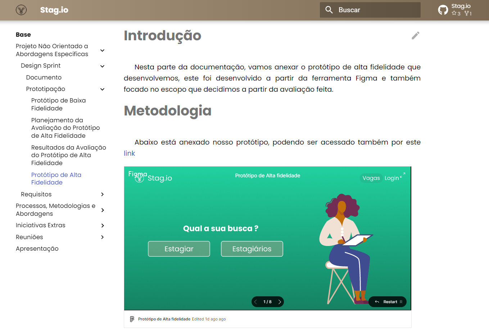
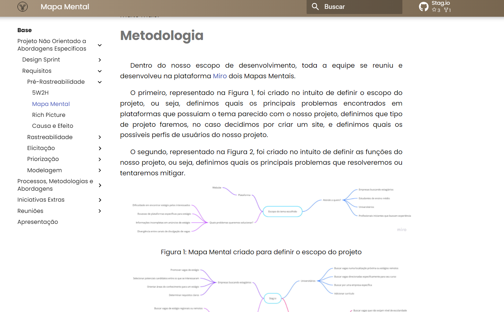
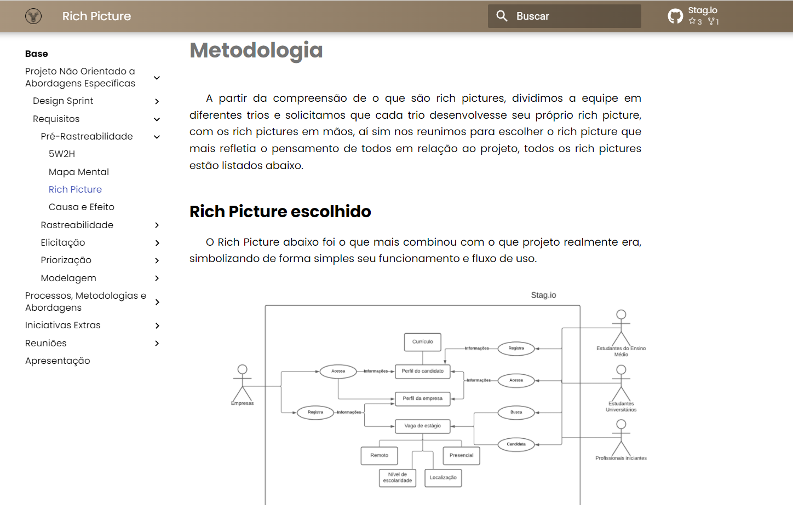
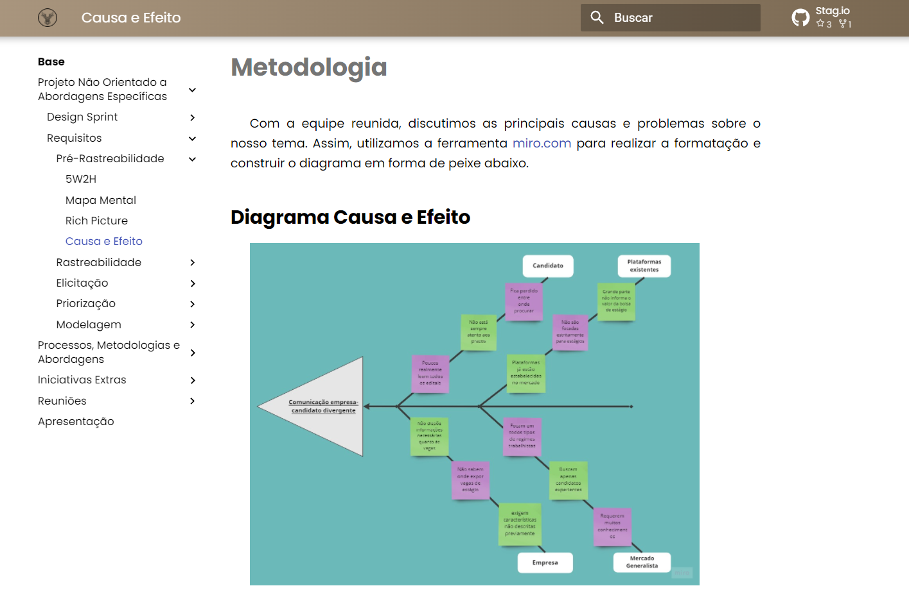
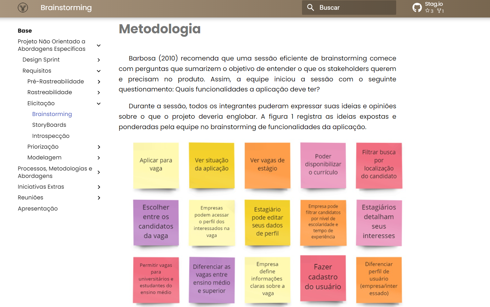

## Vídeo(s) Primeira Entrega <<FOCO: DSW(Base)>>
#### [Projeto Não Orientado a Abordagens Específicas](https://youtu.be/5NcT44FWfZE)

#### [Processos/Metodologias/Abordagens](https://youtu.be/l8euKtAe2IY)

#### [Iniciativas Extras](https://youtu.be/w_Ton-SwaQE)

## Screenshots Segunda Entrega <<FOCO: DSW(Modelagem)>>
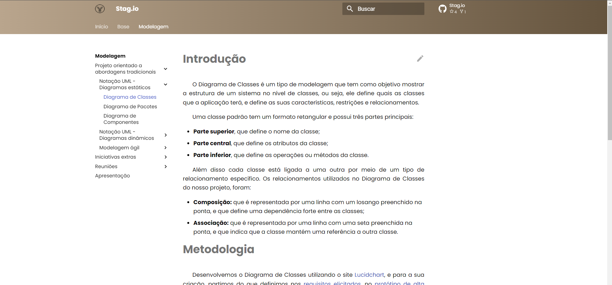
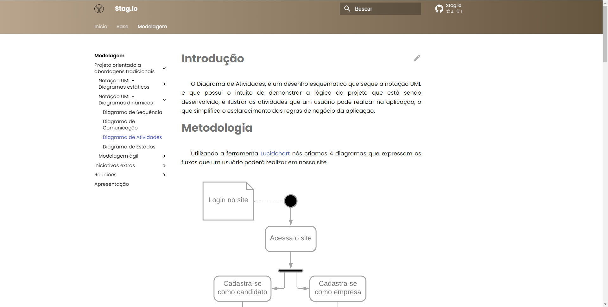
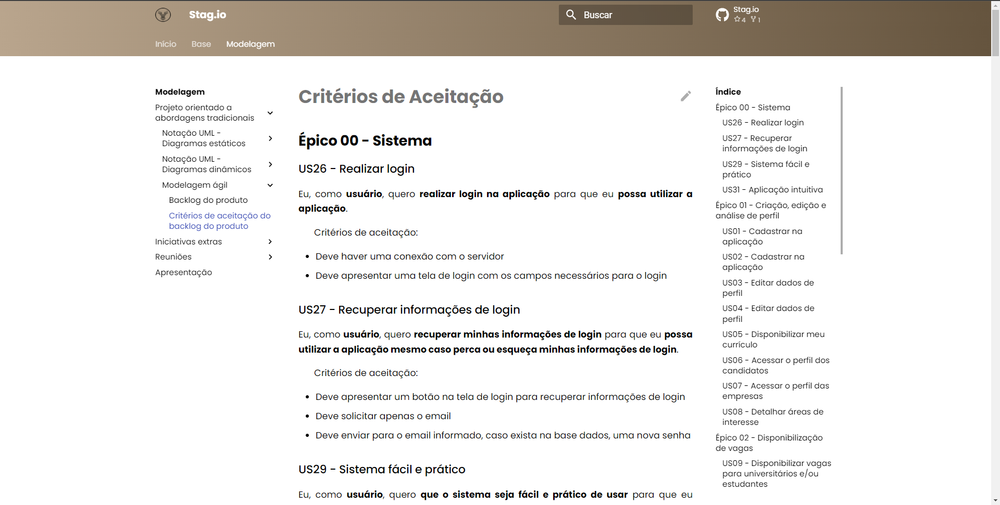
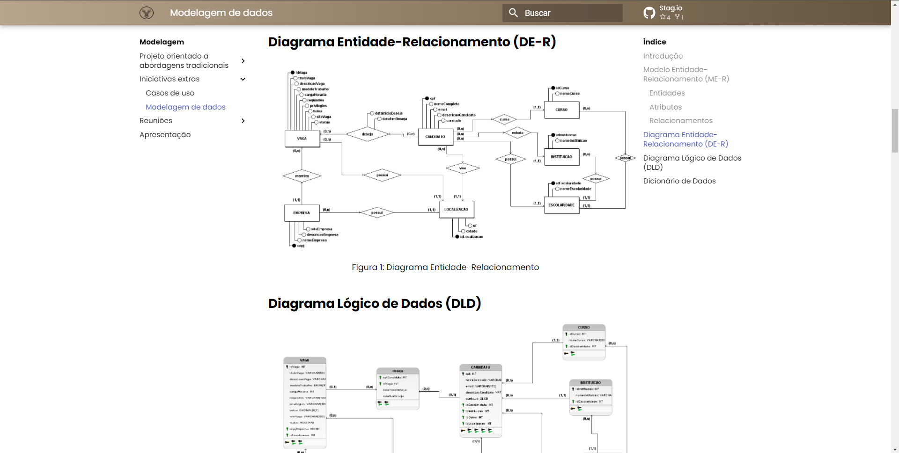

## Vídeo(s) Segunda Entrega <<FOCO: DSW(Modelagem)>>
#### [Modelagem estática](https://youtu.be/oxusPLq8VHQ)

#### [Modelagem dinâmica](https://youtu.be/f45Bx3hbbCM)

#### [Modelagem Ágil](https://youtu.be/NrrG9FC6HvE)

#### [Iniciativas extras e reuniões](https://youtu.be/4xZfjb-JQ7o)

## Screenshots Terceira Entrega <<FOCO: DSW(Padrões de Projeto)>>
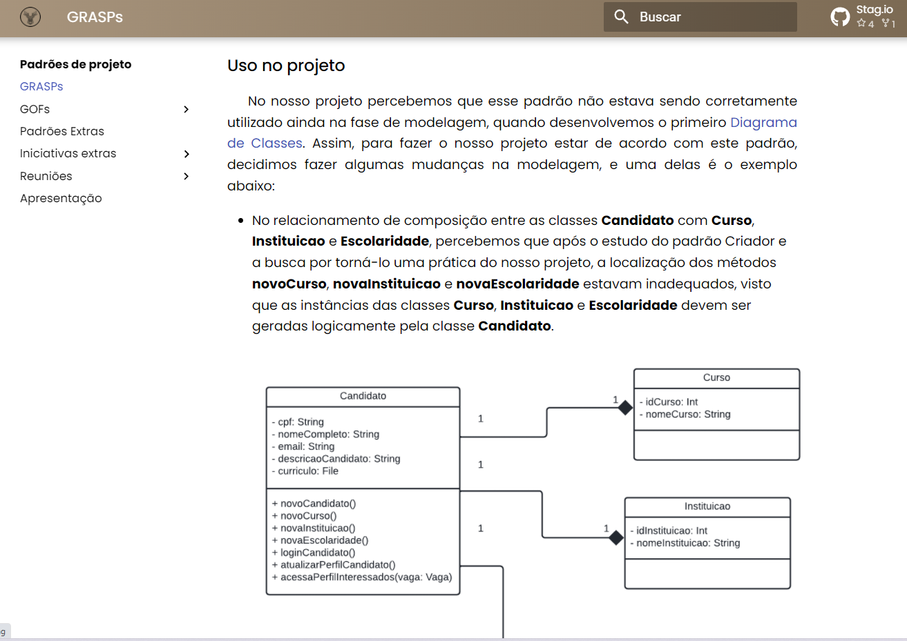
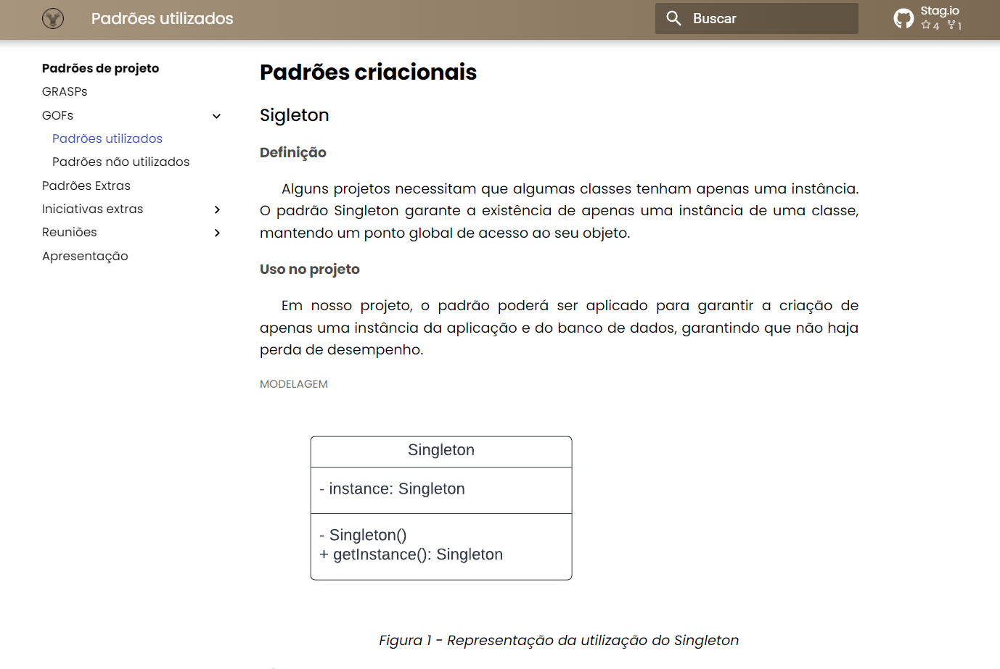
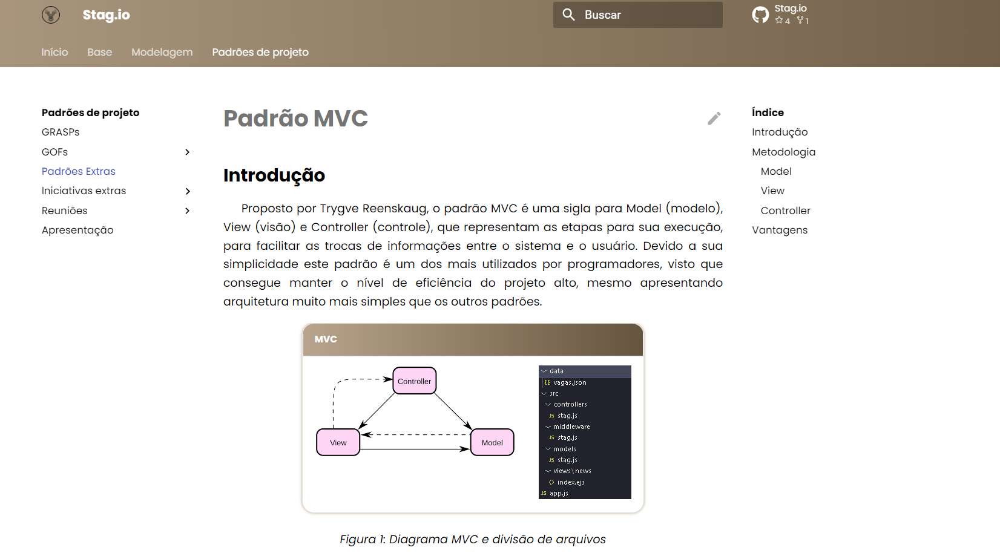

OBS: Não constam Screenshots, na Home Page do Projeto, até o prazo da Terceira Entrega (Professora)

## Vídeo(s) Terceira Entrega <<FOCO: DSW(Padrões de Projeto)>>
#### [GRASPS](https://youtu.be/F6Z662Jk1QM)

#### [GOFs](https://youtu.be/CTIqRVlneEU)

#### [Padrões Extras](https://youtu.be/XX9w3tuVDL8)

#### [Iniciativas Extras e Reuniões](https://youtu.be/g5zsd8-kDNQ)
  
OBS: Não constam Vídeos, na Home Page do Projeto, até o prazo da Terceira Entrega (Professora)

## Screenshots Quarta Entrega (FINAL) <<FOCOS: Arquitetura & Reutilização de Software & PROJETO FINAL>>

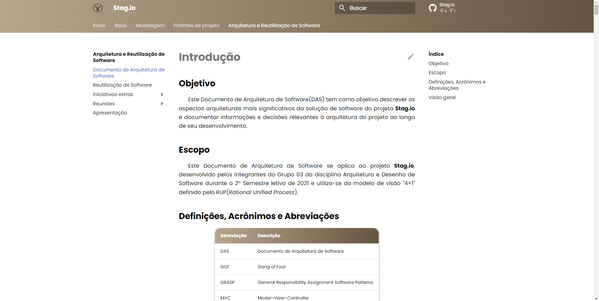
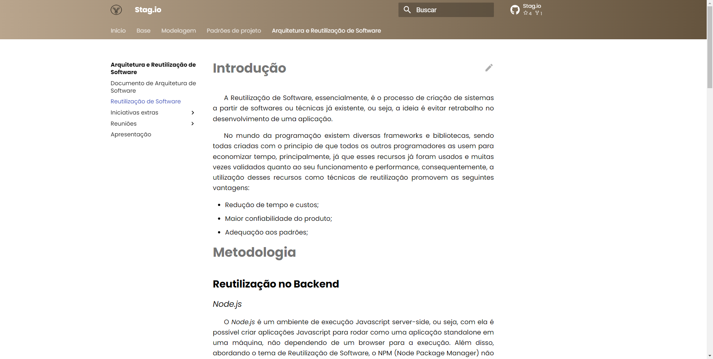
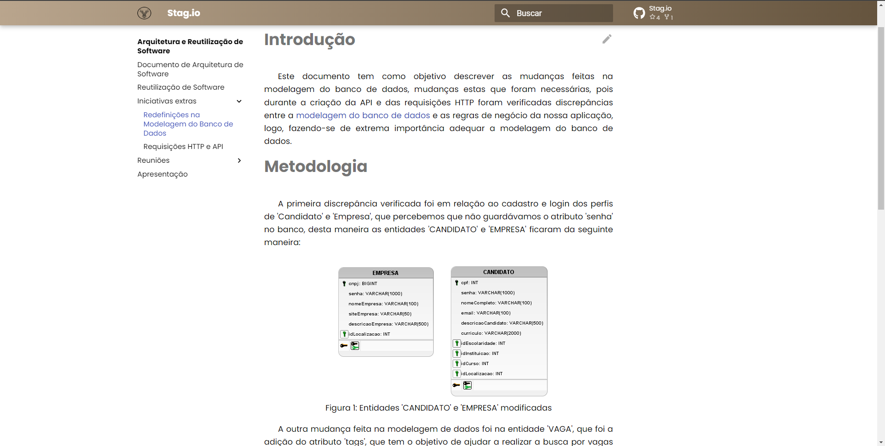
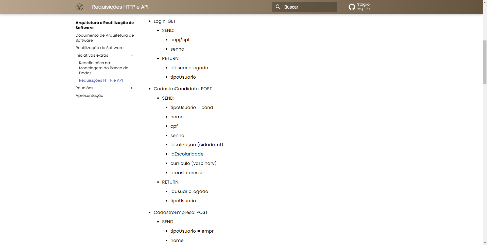

## Vídeo(s) Quarta Entrega (FINAL) <<FOCOS: Arquitetura & Reutilização de Software & PROJETO FINAL>>

#### [DocumentoDeArquitetura](https://youtu.be/AeRdzPvC81A)
#### [ReutilizacaoDeSoftware](https://youtu.be/78CjargOrhg)
#### [IEModelagemDeDados](https://youtu.be/H8tOqjT750Q)
#### [IERequisicoes](https://youtu.be/xDzCc7-YdiA)

## Descritivo dos Principais Aspectos Técnicos 
**Principal(is) Metodologia(s) Adotada(s)**: Scrum e eXtreme Programming<br>
**Principais Linguagens Utilizadas e/ou Pretendidas**: JavaScript<br>
**Principais Tecnologias Utilizadas e/ou Pretendidas**: Node.js, React.js, Express.js<br>
**Principal(is) Estilo(s) Arquitetural(is) Adotado(s)**: MVC, RUP<br>

## O Projeto está rodando?
(X) SIM
( ) NÃO

### Requisitos

- Node 16.13.2
- NPM 8.1.2

### Instalação

- #### Instalação do Node no Windows

    Basta ir ao [site oficial do Node.js](https://nodejs.org/) e baixar o instalador.
Além disso, certifique-se de ter o "git" disponível em seu PATH, o "npm" pode precisar dele (Você pode encontrar o git [aqui](https://git-scm.com/)).

- #### Instalação do Node no Ubuntu

  Você pode instalar nodejs e npm facilmente com o apt install, basta executar os seguintes comandos.

      $ sudo apt install nodejs
      $ sudo apt install npm

- #### Outros sistemas operacionais
  Você pode encontrar mais informações sobre a instalação no [site oficial Node.js](https://nodejs.org/) e no [site oficial NPM](https://npmjs.org/).

### Como rodar o front-end?

1. Faça o clone deste repositório

    ```sh
    git clone https://github.com/UnBArqDsw2021-2/2021.2_G3_stag.io_Frontend.git
    ```

2. Acesse a pasta 'stag.io'

    ```sh
    cd stag.io/
    ```
3. Instale os pacotes necessários
    
    Este comando só precisa ser feito uma vez, caso instale um novo pacote, o arquivo package.json será atualizado.

    ```bash
    npm install
    ```
4. Rodar a aplicação

    ```bash
    npm start
    ```

Agora a aplicação estará rodando na porta 3000, por padrão, basta acessar <a href='http://localhost:3000/'>aqui</a>

### Como rodar o back-end?

Caso queira rodar o back-end é só executar o passos abaixo, porém necessita inserir a credenciais do banco de dados da variáveis de ambiente, seguindo os padrões abaixo:

USER=""
PASSWORD=""
SERVER=""
DATABASE=""

Agora é só seguir os passos abaixo

1. Faça o clone deste repositório

    ```sh
    git clone https://github.com/UnBArqDsw2021-2/2021.2_G3_stag.io_Backend.git
    ```

2. Acesse a pasta

    ```sh
    cd 2021.2_G3_stag.io_Backend/
    ```
3. Instale os pacotes necessários
    
    Este comando só precisa ser feito uma vez, caso instale um novo pacote, o arquivo package.json será atualizado.

    ```bash
    npm install
    ```
4. Rodar a aplicação

    ```bash
    npm start
    ```

Agora a api estará rodando na porta 3001, por padrão, basta acessar <a href='http://localhost:3001/'>aqui</a> e fazer as requisições necessárias.

## Informações Complementares

Para executar o front-end não necessita do back-end, pois o mesmo já está hospedado em produção no Heroku e sua API já é referenciada no front-end.
