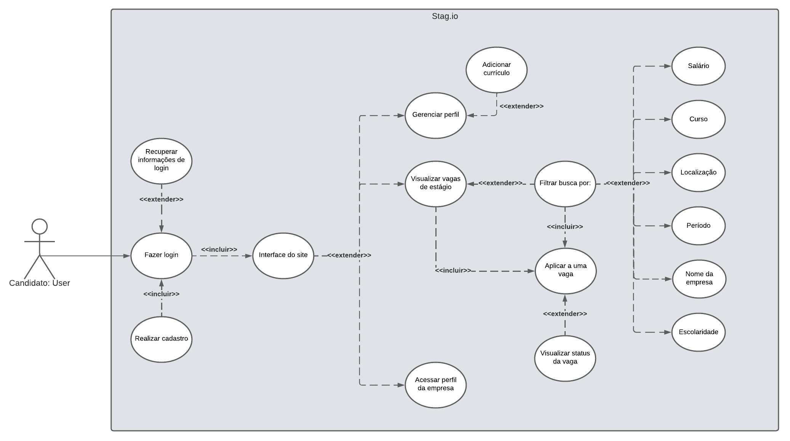
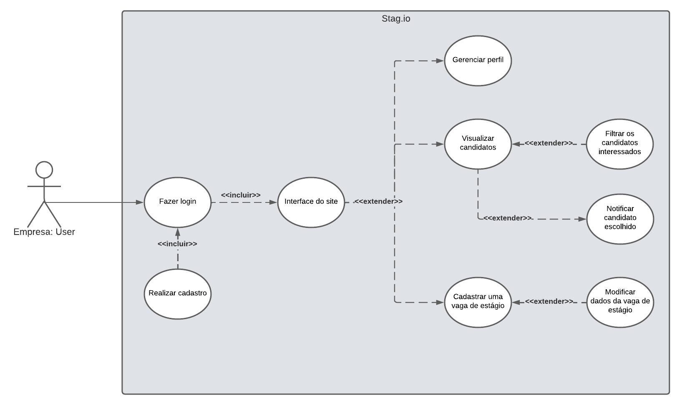
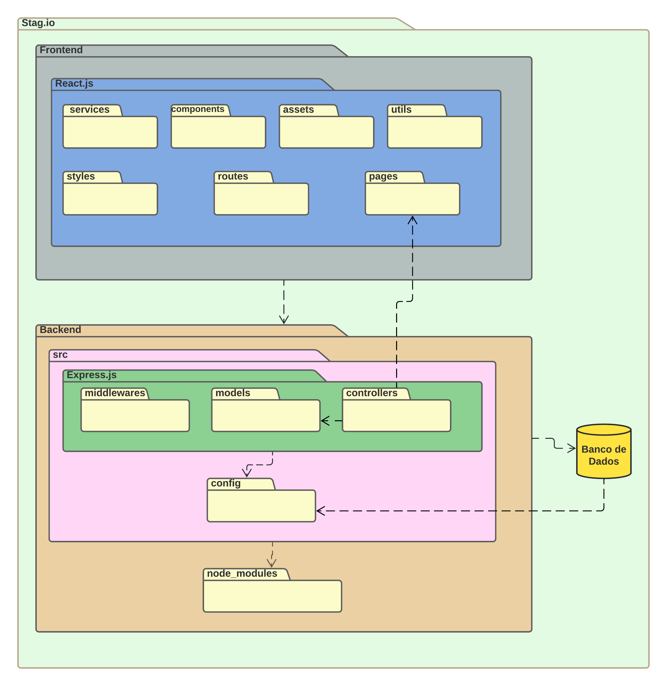

# Introdução

## Objetivo
Este Documento de Arquitetura de Software(DAS) tem como objetivo descrever os aspectos arquiteturais mais significativos da solução de software do projeto **Stag.io** e documentar informações e decisões relevantes  à arquitetura do projeto ao longo de seu desenvolvimento. 

## Escopo 

Este Documento de Arquitetura de Software se aplica ao projeto **Stag.io**, desenvolvido pelos integrantes do Grupo 03 da disciplina Arquitetura e Desenho de Software durante o 2º Semestre letivo de 2021 e utiliza-se do modelo de visão "4+1" definido pelo RUP(*Rational Unified Process*).

## Definições, Acrônimos e Abreviações

Abreviação | Descrição |
|--|--|
|DAS|Documento de Arquitetura de Software|
|SQL|Structured Query Language|
|RUP|Rational Unified Process|

<figcaption>Tabela 1 - Descrição de abreviações</figcaption>

## Visão geral

# Metodologia

## Representação Arquitetural
### Frontend

O ReactJS é uma biblioteca JavaScript de código aberto com foco na criação de interfaces de usuário em páginas web. Esta tecnologia foi escolhida pela facilidade de aplicação por parte da equipe e por possibilitar um rápido desenvolvimento.

### Backend

O Node.js é um ambiente de tempo de execução JavaScript e o Express.js é um framework Node.js de código aberto muito utilizado para o desenvolvimento de aplicações web. Estas tecnologias foram escolhidas pela facilidade de aplicação por parte da equipe e por alinharem-se às necessidades do projeto.

### Banco de dados

O Microsoft SQL Server é um Sistema Gerenciador de Banco de Dados Relacional que trabalha com linguagem SQL. 

## Metas e Restrições Arquiteturais

### Metas

Meta | Descrição |
|--|--|
|Usabilidade|O usuário deverá ser capaz de realizar as tarefas que deseja sem maiores dificuldades;|
|Escalabilidade|A aplicação deve ser suficientemente escalável para possibilitar futuras evoluções;|
|Responsividade|A aplicação deve ser responsiva; |
|Segurança|A aplicação deve contar com mecanismos de proteção para lidar com os dados sensíveis dos usuários.|

<figcaption>Tabela 2 - Metas</figcaption>

### Restrições

Restrição | Descrição |
|--|--|
|Conectividade|É necessário conexão com a internet para utilizar a aplicação;|
|Idioma|A aplicação deve ser desenvolvida em português do Brasil;|
|Público|A aplicação deve ser voltada a empresas que desejam divulgar vagas de estágio e possíveis candidatos interessados nessas vagas;|
|Prazo|O desenvolvimento da aplicação e a documentação correspondente  devem  estar de acordo com os prazos estabelecidos na disciplina Arquitetura e Desenho de Software durante o 2º Semestre letivo de 2021.|

<figcaption>Tabela 3 - Restrições</figcaption>

## Visão de Casos de Uso

A Visão de Casos de Uso descreve um modelo de alto nível em relação as funcionalidades do sistema. Os casos de uso descrevem as funcionalidades que foram propostas, descrevendo um conjunto de ações que o sistema deve desempenhar com a colaboração de um ou mais usuários externos. 

### Caso de uso - Candidato

<figcaption>Figura 1 - Diagrama caso de uso Candidato</figcaption>

#### Cadastrar Candidato

| Caso 1          | Informações                                                                                                                                                                                                                                                 |
| --------------- | ----------------------------------------------------------------------------------------------------------------------------------------------------------------------------------------------------------------------------------------------------------- |
| Descrição       | Quando o site é acessado é necessário realizar o login para acessar as vagas                                                                                                                            |
| Ator(es)        | Candidatos                                                                                                                                                                                                                                                     |
| Pré-condições   | Ter acesso à internet e ter navegador instalado                                                                                                                                                                                                              |
| Fluxo           | 1 - O ator precisa abrir o site  2 - Necessita criar uma conta com seus dados  |
| Pós-condições   | O autor terá acesso a todas as funcionalidades do site                                                                                        |                                                                                                                                          |
<figcaption>Tabela 4 - Descrição Caso de uso 1</figcaption>

 

#### Gerenciar Perfil - Candidato

| Caso 2          | Informações                                                                                                                                                                                                                                                 |
| --------------- | ----------------------------------------------------------------------------------------------------------------------------------------------------------------------------------------------------------------------------------------------------------- |
| Descrição       | Quando já logado no site, é possível editar perfil de usuário adicionando currículo e outras informações                                                                                                                            |
| Ator(es)        | Candidatos                                                                                                                                                                                                                                                     |
| Pré-condições   | Ter acesso à internet e ter navegador instalado                                                                                                                                                                                                              |
| Fluxo           | 1 - O ator precisa abrir o site  2 - Precisa estar cadastrado e logado  3 - Acessar a área de perfil e gerenciar os seus dados  |
| Pós-condições   | O usuário tera seus dados atualizados                                                                                 |                                                                                                                                          |
<figcaption>Tabela 5 - Descrição Caso de uso 2</figcaption>

 

#### Visualizar vaga de estágio

| Caso 3          | Informações                                                                                                                                                                                                                                                 |
| --------------- | ----------------------------------------------------------------------------------------------------------------------------------------------------------------------------------------------------------------------------------------------------------- |
| Descrição       | Quando já logado no site, o usuário poderá visualizar as vagas de estágio e filtrar com as características desejadas                                                                                                                           |
| Ator(es)        | Candidatos                                                                                                                                                                                                                                                     |
| Pré-condições   | Ter acesso à internet e ter navegador instalado  e cadastro no site                                                                                                                                                                                                             |
| Fluxo           | 1 - O ator precisa abrir o site  2 - Precisa estar cadastrado e logado  3 - Acessar a área de estágios  4 - Buscar o estágio desejado  5 - Aplicar para esse estágio encontrado  6 - Receber notificações do status da sua vaga  |
| Pós-condições   | O usuário aguarda aprovação e status da sua vaga                                                                                 |                                                                                                                                          |
<figcaption>Tabela 6 - Descrição Caso de uso 3</figcaption>

 

#### Acessar perfil da empresa

| Caso 4          | Informações                                                                                                                                                                                                                                                 |
| --------------- | ----------------------------------------------------------------------------------------------------------------------------------------------------------------------------------------------------------------------------------------------------------- |
| Descrição       | Quando já logado no site, o usuário poderá acessar o perfil da empresa que esta aplicando a vaga de estágio                                                                                                                          |
| Ator(es)        | Candidatos                                                                                                                                                                                                                                                     |
| Pré-condições   | Ter acesso à internet e ter navegador instalado  e cadastro no site                                                                                                                                                                                                             |
| Fluxo           | 1 - O ator precisa abrir o site  2 - Precisa estar cadastrado e logado  3 - Acessar a área de estágios  4 - Visualizar a empresa que está aplicando estágio  5 - Ver as informações da empresa  |
| Pós-condições   | O usuário descobre qual empresa está aplicando o estágio e suas informações                                                                                 |                                                                                                                                          |
<figcaption>Tabela 7 - Descrição Caso de uso 4</figcaption>

 

### Caso de uso - Empresa

<figcaption>Figura 2 - Diagrama caso de uso Empresa</figcaption>

#### Cadastrar empresa

| Caso 5          | Informações                                                                                                                                                                                                                                                 |
| --------------- | ----------------------------------------------------------------------------------------------------------------------------------------------------------------------------------------------------------------------------------------------------------- |
| Descrição       | Quando o site é acessado pela primeira vez, é necessário realizar um cadastro para ter acesso as funcionalidades do site                                                                                                                            |
| Ator(es)        | Empresa                                                                                                                                                                                                                                                     |
| Pré-condições   | Ter acesso à internet e o navegador instalado                                                                                                                                                                                                              |
| Fluxo           | 1 - O ator precisa abrir o site  2 - Necessita inserir um email e senha válidos 3 - Necessita inserir um CNPJ válido  4 - O autor então terá de resolver um CAPTCHA e então é finalizado o cadastro |
| Pós-condições   | O autor terá acesso a todas as funcionalidades do aplicativo                                                                                                                                                                                                |

<figcaption>Tabela 8 - Descrição Caso de uso 5</figcaption>

 

#### Gerenciar Perfil - Empresa

| Caso 6          | Informações                                                                                                                                                                                                                                                 |
| --------------- | ----------------------------------------------------------------------------------------------------------------------------------------------------------------------------------------------------------------------------------------------------------- |
| Descrição       | Quando o usuário deseja alterar ou incluir novos dados ao seu perfil, após já possuir uma conta                                                                                                                            |
| Ator(es)        | Empresa                                                                                                                                                                                                                                                     |
| Pré-condições   | Ter acesso à internet e o navegador instalado                                                                                                                                                                                                              |
| Fluxo           | 1 - O ator precisa abrir o site  2 - Necessita logar na sua conta previamente cadastrada 3 - Navegar até o seu perfil  4 - Selecionar o ícone de EDIÇÃO  5 - Salvar as alterações de perfil|
| Pós-condições   | O autor terá livre acesso a modificar os dados de seu perfil quando desejar                                                                                                                                                                                              |

<figcaption>Tabela 9 - Descrição Caso de uso 6</figcaption>

 

#### Visualizar perfil de candidato

| Caso 7          | Informações                                                                                                                                                                                                                                                 |
| --------------- | ----------------------------------------------------------------------------------------------------------------------------------------------------------------------------------------------------------------------------------------------------------- |
| Descrição       | Quando um usuário se candidatar a uma vaga disponibilizada pela empresa e ela desejar avaliar o seu perfil                                                                                                                           |
| Ator(es)        | Empresa e Candidato                                                                                                                                                                                                                                                     |
| Pré-condições   | Ter acesso à internet e o navegador instalado                                                                                                                                                                                                              |
| Fluxo           | 1 - A empresa precisa abrir o site  2 - Necessita logar na sua conta previamente cadastrada 3 - Quando houver um candidato a vaga a aba de notificações no perfil da empresa ficará sinalizado e assim deve ser selecionada  4 - Então, a empresa será direcionada a uma página com os candidatos aquela vaga  5 - Clicar no nome de um candidato exibirá o seu perfil|
| Pós-condições   | A empresa poderá visualizar todos os perfis de candidatos para uma vaga disponibilizada por ela                                                                                                                                                                                              |

<figcaption>Tabela 10 - Descrição Caso de uso 7</figcaption>

 

#### Cadastrar vaga de estágio

| Caso 8          | Informações                                                                                                                                                                                                                                                 |
| --------------- | ----------------------------------------------------------------------------------------------------------------------------------------------------------------------------------------------------------------------------------------------------------- |
| Descrição       | Quando uma empresa deseja divulgar uma vaga para estágios e decide utilizar o Stag.io                                                                                                                           |
| Ator(es)        | Empresa                                                                                                                                                                                                                                                     |
| Pré-condições   | Ter acesso à internet e o navegador instalado                                                                                                                                                                                                              |
| Fluxo           | 1 - A empresa precisa abrir o site  2 - Necessita logar na sua conta previamente cadastrada 3 - Na tela inicial o usuário deverá selecionar o ícone do seu perfil  4 - Então, será direcionada a uma página com os dados da empresa e assim selecionar a opção "Criar nova vaga"  5 - Assim serão requisitados os dados e o tipo de vaga que este usuário gostaria de criar  6 - Finalizar o processo clicando no botão "Publicar nova Vaga"|
| Pós-condições   | A empresa disponibilizará os dados a respeito da vaga criada na plataforma e será notificada dos usuários que se inscreverem nela                                                                                                                                                                                              |

<figcaption>Tabela 11 - Descrição Caso de uso 8</figcaption>

 

Demais detalhes dos casos de uso do projeto Stag.io podem ser visualizados no <a href="https://unbarqdsw2021-2.github.io/2021.2_G3_stag.io/Modelagem/IE/CasosDeUso/"> documento de casos de uso</a>, desenvolvido na etapa de modelagem do projeto.

## Visão Lógica
A Visão Lógica descreve a organização conceitual do software em termos de camadas, subsistemas, pacotes, frameworks, classes e interfaces.

### Diagrama de Pacotes
Os<a href="https://unbarqdsw2021-2.github.io/2021.2_G3_stag.io/Modelagem/ME/DiagramaDePacotes/"> Diagramas de Pacotes</a> são utilizados para proporcionar uma organização visual da arquitetura de um sistema e para explicitar a disposição e organização dos elementos

<figcaption> Figura 3 - Diagrama de Pacotes da aplicação </figcaption>

### Diagrama de Classes

O <a href="https://unbarqdsw2021-2.github.io/2021.2_G3_stag.io/Modelagem/ME/DiagramaDeClasse/"> Diagrama de Classes</a> é um tipo de modelagem que tem como objetivo mostrar a estrutura de um sistema no nível de classes, ou seja, ele define quais as classes que a aplicação terá, e define as características, restrições e relacionamentos de cada uma dessas classes.

<figcaption>Figura 4: Diagrama de Classes da aplicação</figcaption>

## Visão de Processos

## Visão de Implementação

## Visão de Dados

## Tamanho e Desempenho

## Qualidade

# Bibliografia

# Versionamento

Versão | Data | Modificação | Autor(es) |
|--|--|--|--|
|1.0|07/04/2021|Criação do documento e introdução|Hérya|