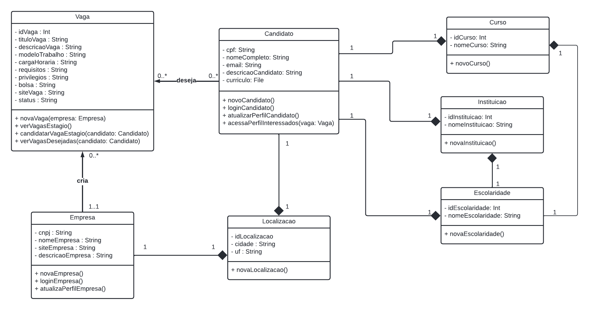
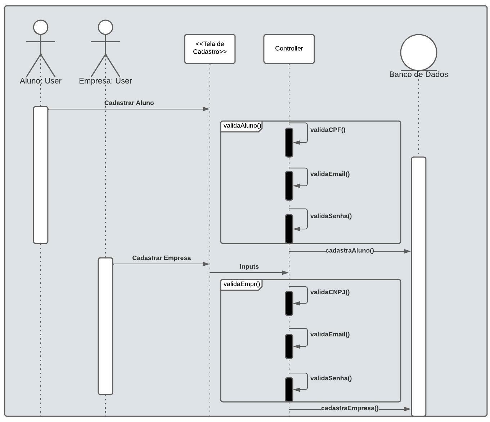

# Introdução

## Objetivo
Este Documento de Arquitetura de Software(DAS) tem como objetivo descrever os aspectos arquiteturais mais significativos da solução de software do projeto **Stag.io** e documentar informações e decisões relevantes  à arquitetura do projeto ao longo de seu desenvolvimento. 

## Escopo 

Este Documento de Arquitetura de Software se aplica ao projeto **Stag.io**, desenvolvido pelos integrantes do Grupo 03 da disciplina Arquitetura e Desenho de Software durante o 2º Semestre letivo de 2021 e utiliza-se do modelo de visão "4+1" definido pelo RUP(*Rational Unified Process*).

## Definições, Acrônimos e Abreviações

Abreviação | Descrição |
|--|--|
|DAS|Documento de Arquitetura de Software|
|MVC|Model–View–Controller|
|RUP|Rational Unified Process|
|SQL|Structured Query Language|

<figcaption>Tabela 1 - Descrição de abreviações</figcaption>

## Visão geral

# Metodologia

## Representação Arquitetural
### Frontend

O ReactJS é uma biblioteca JavaScript de código aberto com foco na criação de interfaces de usuário em páginas web. Esta tecnologia foi escolhida pela facilidade de aplicação por parte da equipe e por possibilitar um rápido desenvolvimento.

### Backend

O Node.js é um ambiente de tempo de execução JavaScript e o Express.js é um framework Node.js de código aberto muito utilizado para o desenvolvimento de aplicações web. Estas tecnologias foram escolhidas pela facilidade de aplicação por parte da equipe e por alinharem-se às necessidades do projeto.

### Banco de dados

O Microsoft SQL Server é um Sistema Gerenciador de Banco de Dados Relacional que trabalha com linguagem SQL. 

## Metas e Restrições Arquiteturais

### Metas

Meta | Descrição |
|--|--|
|Usabilidade|O usuário deverá ser capaz de realizar as tarefas que deseja sem maiores dificuldades;|
|Escalabilidade|A aplicação deve ser suficientemente escalável para possibilitar futuras evoluções;|
|Responsividade|A aplicação deve ser responsiva; |
|Segurança|A aplicação deve contar com mecanismos de proteção para lidar com os dados sensíveis dos usuários.|

<figcaption>Tabela 2 - Metas</figcaption>

### Restrições

Restrição | Descrição |
|--|--|
|Conectividade|É necessário conexão com a internet para utilizar a aplicação;|
|Idioma|A aplicação deve ser desenvolvida em português do Brasil;|
|Público|A aplicação deve ser voltada a empresas que desejam divulgar vagas de estágio e possíveis candidatos interessados nessas vagas;|
|Prazo|O desenvolvimento da aplicação e a documentação correspondente  devem  estar de acordo com os prazos estabelecidos na disciplina Arquitetura e Desenho de Software durante o 2º Semestre letivo de 2021.|

<figcaption>Tabela 3 - Restrições</figcaption>

## Visão de Casos de Uso

A Visão de Casos de Uso descreve um modelo de alto nível em relação as funcionalidades do sistema. Os casos de uso descrevem as funcionalidades que foram propostas, descrevendo um conjunto de ações que o sistema deve desempenhar com a colaboração de um ou mais usuários externos. 

### Caso de uso - Candidato

<figcaption>Figura 1 - Diagrama caso de uso Candidato</figcaption>

#### Cadastrar Candidato

| Caso 1          | Informações                                                                                                                                                                                                                                                 |
| --------------- | ----------------------------------------------------------------------------------------------------------------------------------------------------------------------------------------------------------------------------------------------------------- |
| Descrição       | Quando o site é acessado é necessário realizar o login para acessar as vagas                                                                                                                            |
| Ator(es)        | Candidatos                                                                                                                                                                                                                                                     |
| Pré-condições   | Ter acesso à internet e ter navegador instalado                                                                                                                                                                                                              |
| Fluxo           | 1 - O ator precisa abrir o site  2 - Necessita criar uma conta com seus dados  |
| Pós-condições   | O autor terá acesso a todas as funcionalidades do site                                                                                        |                                                                                                                                          |
<figcaption>Tabela 4 - Descrição Caso de uso 1</figcaption>

 

#### Gerenciar Perfil - Candidato

| Caso 2          | Informações                                                                                                                                                                                                                                                 |
| --------------- | ----------------------------------------------------------------------------------------------------------------------------------------------------------------------------------------------------------------------------------------------------------- |
| Descrição       | Quando já logado no site, é possível editar perfil de usuário adicionando currículo e outras informações                                                                                                                            |
| Ator(es)        | Candidatos                                                                                                                                                                                                                                                     |
| Pré-condições   | Ter acesso à internet e ter navegador instalado                                                                                                                                                                                                              |
| Fluxo           | 1 - O ator precisa abrir o site  2 - Precisa estar cadastrado e logado  3 - Acessar a área de perfil e gerenciar os seus dados  |
| Pós-condições   | O usuário tera seus dados atualizados                                                                                 |                                                                                                                                          |
<figcaption>Tabela 5 - Descrição Caso de uso 2</figcaption>

 

#### Visualizar vaga de estágio

| Caso 3          | Informações                                                                                                                                                                                                                                                 |
| --------------- | ----------------------------------------------------------------------------------------------------------------------------------------------------------------------------------------------------------------------------------------------------------- |
| Descrição       | Quando já logado no site, o usuário poderá visualizar as vagas de estágio e filtrar com as características desejadas                                                                                                                           |
| Ator(es)        | Candidatos                                                                                                                                                                                                                                                     |
| Pré-condições   | Ter acesso à internet e ter navegador instalado  e cadastro no site                                                                                                                                                                                                             |
| Fluxo           | 1 - O ator precisa abrir o site  2 - Precisa estar cadastrado e logado  3 - Acessar a área de estágios  4 - Buscar o estágio desejado  5 - Aplicar para esse estágio encontrado  6 - Receber notificações do status da sua vaga  |
| Pós-condições   | O usuário aguarda aprovação e status da sua vaga                                                                                 |                                                                                                                                          |
<figcaption>Tabela 6 - Descrição Caso de uso 3</figcaption>

 

#### Acessar perfil da empresa

| Caso 4          | Informações                                                                                                                                                                                                                                                 |
| --------------- | ----------------------------------------------------------------------------------------------------------------------------------------------------------------------------------------------------------------------------------------------------------- |
| Descrição       | Quando já logado no site, o usuário poderá acessar o perfil da empresa que esta aplicando a vaga de estágio                                                                                                                          |
| Ator(es)        | Candidatos                                                                                                                                                                                                                                                     |
| Pré-condições   | Ter acesso à internet e ter navegador instalado  e cadastro no site                                                                                                                                                                                                             |
| Fluxo           | 1 - O ator precisa abrir o site  2 - Precisa estar cadastrado e logado  3 - Acessar a área de estágios  4 - Visualizar a empresa que está aplicando estágio  5 - Ver as informações da empresa  |
| Pós-condições   | O usuário descobre qual empresa está aplicando o estágio e suas informações                                                                                 |                                                                                                                                          |
<figcaption>Tabela 7 - Descrição Caso de uso 4</figcaption>

 

### Caso de uso - Empresa

<figcaption>Figura 2 - Diagrama caso de uso Empresa</figcaption>

#### Cadastrar empresa

| Caso 5          | Informações                                                                                                                                                                                                                                                 |
| --------------- | ----------------------------------------------------------------------------------------------------------------------------------------------------------------------------------------------------------------------------------------------------------- |
| Descrição       | Quando o site é acessado pela primeira vez, é necessário realizar um cadastro para ter acesso as funcionalidades do site                                                                                                                            |
| Ator(es)        | Empresa                                                                                                                                                                                                                                                     |
| Pré-condições   | Ter acesso à internet e o navegador instalado                                                                                                                                                                                                              |
| Fluxo           | 1 - O ator precisa abrir o site  2 - Necessita inserir um email e senha válidos 3 - Necessita inserir um CNPJ válido  4 - O autor então terá de resolver um CAPTCHA e então é finalizado o cadastro |
| Pós-condições   | O autor terá acesso a todas as funcionalidades do aplicativo                                                                                                                                                                                                |

<figcaption>Tabela 8 - Descrição Caso de uso 5</figcaption>

 

#### Gerenciar Perfil - Empresa

| Caso 6          | Informações                                                                                                                                                                                                                                                 |
| --------------- | ----------------------------------------------------------------------------------------------------------------------------------------------------------------------------------------------------------------------------------------------------------- |
| Descrição       | Quando o usuário deseja alterar ou incluir novos dados ao seu perfil, após já possuir uma conta                                                                                                                            |
| Ator(es)        | Empresa                                                                                                                                                                                                                                                     |
| Pré-condições   | Ter acesso à internet e o navegador instalado                                                                                                                                                                                                              |
| Fluxo           | 1 - O ator precisa abrir o site  2 - Necessita logar na sua conta previamente cadastrada 3 - Navegar até o seu perfil  4 - Selecionar o ícone de EDIÇÃO  5 - Salvar as alterações de perfil|
| Pós-condições   | O autor terá livre acesso a modificar os dados de seu perfil quando desejar                                                                                                                                                                                              |

<figcaption>Tabela 9 - Descrição Caso de uso 6</figcaption>

 

#### Visualizar perfil de candidato

| Caso 7          | Informações                                                                                                                                                                                                                                                 |
| --------------- | ----------------------------------------------------------------------------------------------------------------------------------------------------------------------------------------------------------------------------------------------------------- |
| Descrição       | Quando um usuário se candidatar a uma vaga disponibilizada pela empresa e ela desejar avaliar o seu perfil                                                                                                                           |
| Ator(es)        | Empresa e Candidato                                                                                                                                                                                                                                                     |
| Pré-condições   | Ter acesso à internet e o navegador instalado                                                                                                                                                                                                              |
| Fluxo           | 1 - A empresa precisa abrir o site  2 - Necessita logar na sua conta previamente cadastrada 3 - Quando houver um candidato a vaga a aba de notificações no perfil da empresa ficará sinalizado e assim deve ser selecionada  4 - Então, a empresa será direcionada a uma página com os candidatos aquela vaga  5 - Clicar no nome de um candidato exibirá o seu perfil|
| Pós-condições   | A empresa poderá visualizar todos os perfis de candidatos para uma vaga disponibilizada por ela                                                                                                                                                                                              |

<figcaption>Tabela 10 - Descrição Caso de uso 7</figcaption>

 

#### Cadastrar vaga de estágio

| Caso 8          | Informações                                                                                                                                                                                                                                                 |
| --------------- | ----------------------------------------------------------------------------------------------------------------------------------------------------------------------------------------------------------------------------------------------------------- |
| Descrição       | Quando uma empresa deseja divulgar uma vaga para estágios e decide utilizar o Stag.io                                                                                                                           |
| Ator(es)        | Empresa                                                                                                                                                                                                                                                     |
| Pré-condições   | Ter acesso à internet e o navegador instalado                                                                                                                                                                                                              |
| Fluxo           | 1 - A empresa precisa abrir o site  2 - Necessita logar na sua conta previamente cadastrada 3 - Na tela inicial o usuário deverá selecionar o ícone do seu perfil  4 - Então, será direcionada a uma página com os dados da empresa e assim selecionar a opção "Criar nova vaga"  5 - Assim serão requisitados os dados e o tipo de vaga que este usuário gostaria de criar  6 - Finalizar o processo clicando no botão "Publicar nova Vaga"|
| Pós-condições   | A empresa disponibilizará os dados a respeito da vaga criada na plataforma e será notificada dos usuários que se inscreverem nela                                                                                                                                                                                              |

<figcaption>Tabela 11 - Descrição Caso de uso 8</figcaption>

 

Demais detalhes dos casos de uso do projeto Stag.io podem ser visualizados no <a href="https://unbarqdsw2021-2.github.io/2021.2_G3_stag.io/Modelagem/IE/CasosDeUso/"> documento de casos de uso</a>, desenvolvido na etapa de modelagem do projeto.

## Visão Lógica
A Visão Lógica descreve a organização conceitual do software em termos de camadas, subsistemas, pacotes, frameworks, classes e interfaces.

### Diagrama de Pacotes
Os<a href="https://unbarqdsw2021-2.github.io/2021.2_G3_stag.io/Modelagem/ME/DiagramaDePacotes/"> Diagramas de Pacotes</a> são utilizados para proporcionar uma organização visual da arquitetura de um sistema e para explicitar a disposição e organização dos elementos

<figcaption> Figura 3 - Diagrama de Pacotes da aplicação </figcaption>

### Diagrama de Classes

O <a href="https://unbarqdsw2021-2.github.io/2021.2_G3_stag.io/Modelagem/ME/DiagramaDeClasse/"> Diagrama de Classes</a> é um tipo de modelagem que tem como objetivo mostrar a estrutura de um sistema no nível de classes, ou seja, ele define quais as classes que a aplicação terá, e define as características, restrições e relacionamentos de cada uma dessas classes.

<figcaption>Figura 4: Diagrama de Classes da aplicação</figcaption>

### Diagrama de Comunicação

O <a href="https://unbarqdsw2021-2.github.io/2021.2_G3_stag.io/Modelagem/MD/DiagramaDeComunicacao/"> Diagrama de Comunicação</a> possui um comportamento dinâmico que demonstra a interação entre objetos e/ou partes utilizando mensagens e setas sequenciadas de um aplicativo ou um sistema de software.

#### Diagrama estudante

<figcaption>Figura 5 - Diagrama do fluxo de estudante</figcaption>

#### Diagrama empresa

<figcaption>Figura 6 - Diagrama do fluxo de empresa</figcaption>

## Visão de Processos

A Visão de Processos descreve processos, responsabilidades, colaborações e alocação de elementos lógicos como camadas, subsistemas e classes.

### Diagrama de Sequência

O <a href="https://unbarqdsw2021-2.github.io/2021.2_G3_stag.io/Modelagem/MD/DiagramaDeSequencia/">Diagrama de Sequência
</a> tem o objetivo de representar um conjunto de objetos que estão interagindo ao longo do funcionamento da aplicação, descrevendo como esses grupos de objetos colaboram entre si em cada caso de uso. Desse modo, é criado um registro do comportamento e das mensagens trocadas entre esses objetos, determinando a sequência que essas ações ocorrem dentro dos processos.

#### Cadastro de Usuário

<figcaption>Figura 7 - Cadastro de Usuário</figcaption>

#### Candidatar em uma vaga de estágio

<figcaption>Figura 8 - Candidatar em uma vaga de estágio</figcaption>

### Diagrama de Atividades
O <a href="https://unbarqdsw2021-2.github.io/2021.2_G3_stag.io/Modelagem/MD/DiagramaDeAtividades/">Diagrama de Atividades
</a> é um desenho esquemático que segue a notação UML e que possui o intuito de demonstrar a lógica do projeto que está sendo desenvolvido, e ilustrar as atividades que um usuário pode realizar na aplicação, o que simplifica o esclarecimento das regras de negócio da aplicação e elucida o fluxo de ações de uma determinada atividade.

#### Realizar login

<figcaption>
Figura 9 - Fluxo de Atividade para realizar o Login
</figcaption>

#### Candidatar a uma vaga

<figcaption>
Figura 10 -Fluxo de Atividade para se candidatar à uma vaga
</figcaption>

#### Acessar as vagas para a qual se candidatou

<figcaption>
Figura 11 - Fluxo de Atividade para acessar as vagas para a qual se candidatou
</figcaption>

#### Acessar interessados em vaga

<figcaption>
Figura 12 - Fluxo de Atividade para a empresa acessar os interessados nas suas vagas
</figcaption>

## Visão de Implantação

## Visão de Implementação
 A visão de Implementação descreve uma visão do modelo de implementação, especificado em texto, e visualizado com pacotes e diagramas de componentes.

### Diagrama de Componentes

O <a href="https://unbarqdsw2021-2.github.io/2021.2_G3_stag.io/Modelagem/ME/DiagramaDeComponentes/">Diagrama de Componentes
</a>  mostra componentes, interfaces fornecidas e necessárias, portas e relacionamentos entre eles. Esse tipo de diagrama é usado no Desenvolvimento Baseado em Componentes para descrever sistemas com Arquitetura Orientada a Serviços.

<figcaption>Figura 13 -  Diagrama de componentes do projeto Stag.io</figcaption>

## Visão de Dados

A Visão de Dados mapeia os objetos aos dados persistentes. Durante a etapa de modelagem do projeto, a equipe realizou a  <a href="https://unbarqdsw2021-2.github.io/2021.2_G3_stag.io/Modelagem/IE/ModelagemDeDados/">modelagem de dados</a> persistentes.

### Diagrama Entidade-Relacionamento (DE-R)

Figura 14 - Diagrama Entidade-Relacionamento

### Diagrama Lógico de Dados (DLD)

Figura 15 - Diagrama Lógico de Dados

### Dicionário de Dados

#### VAGA

Entidade: **VAGA**

Descrição: **Define os dados de uma vaga de estágio sob processo seletivo.**

|  Atributo  | Propriedades do atributo |            Tipo de Dado           |  Tamanho   |                         Descrição                         |
| :--------: | :--------------------: | :---------------------------------: | :--------: | :-------------------------------------------------------: |
|idVaga|chave primária, obrigatório|int|-|Identificador de uma vaga.|
|tituloVaga|obrigatório|varchar|50|Título reduzido de uma vaga.|
|descricaoVaga|obrigatório|varchar|1000|Descrição detalhada de uma vaga.|
|modeloTrabalho|obrigatório|enum(‘Presencial’,’Remoto’,’Híbrido’)|-|Modelo de trabalho, sendo dividido entre presencial, remoto e híbrido.|
|cargaHoraria|obrigatório|int|-|Carga horária de trabalho de uma vaga.|
|requisitos|obrigatório|varchar|1000|Requisitos solicitados por uma vaga. |
|privilegios|obrigatório|varchar|1000|Privilégios concedidos por uma vaga.|
|bolsa|obrigatório|decimal|6,2|Valor monetário da bolsa concedida pela vaga.|
|siteVaga|obrigatório|varchar|200|Site em que está hospedado o processo da vaga.|
|status|obrigatório|boolean|-|Situação de uma vaga, sendo “true” = ativada e “false” = inativada.|
|cnpjEmpresa|obrigatório|bigint|-|CNPJ da empresa que é proprietária de uma vaga.|
|idLocalizacao|chave estrangeira, obrigatório|int|-|Identificador da localização de trabalho de uma vaga.|

<figcaption>Tabela 12 - Dicionário de dados da entidade VAGA</figcaption>

#### EMPRESA

Entidade: **EMPRESA**

Descrição: **Define os dados de uma empresa que pode contratar estagiários.**

|  Atributo  | Propriedades do atributo |            Tipo de Dado           |  Tamanho   |                         Descrição                         |
| :--------: | :--------------------: | :---------------------------------: | :--------: | :-------------------------------------------------------: |
|cnpj|chave primária, obrigatório|bigint|-|Número do CNPJ de uma empresa.|
|nomeEmpresa|obrigatório|varchar|100|Nome de uma empresa.|
|siteEmpresa|obrigatório|varchar|200|Site próprio da empresa.|
|descricaoEmpresa|obrigatório|varchar|1000|Descrição detalhada de uma empresa.|
|idLocalizacao|chave estrangeira, obrigatório|int|-|Identificador da localização de uma empresa|

<figcaption>Tabela 13 - Dicionário de dados da entidade EMPRESA</figcaption>

#### LOCALIZACAO

Entidade: **LOCALIZACAO**

Descrição: **Define os dados de uma localização dentro do Brasil.**

|  Atributo  | Propriedades do atributo |            Tipo de Dado           |  Tamanho   |                         Descrição                         |
| :--------: | :--------------------: | :---------------------------------: | :--------: | :-------------------------------------------------------: |
|idLocalizacao|chave primária, obrigatório|int|-|Identificador de uma localização.|
|cidade|obrigatório|varchar|50|Nome de uma cidade de uma localização.|
|uf|obrigatório|char|2|Sigla do estado de uma localização.|

<figcaption>Tabela 14 - Dicionário de dados da entidade LOCALIZACAO</figcaption>

#### CURSO

Entidade: **CURSO**

Descrição: **Define os dados de um curso, seja universitário ou graus do ensino médio.**

|  Atributo  | Propriedades do atributo |            Tipo de Dado           |  Tamanho   |                         Descrição                         |
| :--------: | :--------------------: | :---------------------------------: | :--------: | :-------------------------------------------------------: |
|idCurso|chave primária, obrigatório|int|-|Identificador de um curso.|
|nomeCurso|obrigatório|varchar|50|Nome de um curso.|
|idEscolaridade|chave estrangeira, obrigatório|int|-|Identificador de escolaridade de um curso.|

<figcaption>Tabela 15 - Dicionário de dados da entidade CURSO</figcaption>

#### INSTITUICAO

Entidade: **INSTITUICAO**

Descrição: **Define os dados de uma instituição de ensino.**

|  Atributo  | Propriedades do atributo |            Tipo de Dado           |  Tamanho   |                         Descrição                         |
| :--------: | :--------------------: | :---------------------------------: | :--------: | :-------------------------------------------------------: |
|idInstituicao|chave primária, obrigatório|int|-|Identificador de uma instituição.|
|nomeInstituicao|obrigatório|varchar|100|Nome de uma instituição de ensino.|
|idEscolaridade|chave estrangeira, obrigatório|int|-|Identificador de escolaridade de uma instituição.|

<figcaption>Tabela 16 - Dicionário de dados da entidade INSTITUICAO</figcaption>

#### ESCOLARIDADE

Entidade: **ESCOLARIDADE**

Descrição: **Define os dados de um nível de escolaridade.**

|  Atributo  | Propriedades do atributo |            Tipo de Dado           |  Tamanho   |                         Descrição                         |
| :--------: | :--------------------: | :---------------------------------: | :--------: | :-------------------------------------------------------: |
|idEscolaridade|chave primária, obrigatório|int|-|Identificador de uma escolaridade.|
|nomeEscolaridade|obrigatório|varchar|50|Nome de uma escolaridade.|

<figcaption>Tabela 17 - Dicionário de dados da entidade ESCOLARIDADE</figcaption>

#### CANDIDATO

Entidade: **CANDIDATO**

Descrição: **Define os dados de um estudante candidato a estagiário.**

|  Atributo  | Propriedades do atributo |            Tipo de Dado           |  Tamanho   |                         Descrição                         |
| :--------: | :--------------------: | :---------------------------------: | :--------: | :-------------------------------------------------------: |
|cpf|chave primária, obrigatório|int|-|Número do documento de CPF de um candidato.|
|nomeCompleto|obrigatório|varchar|200|Nome de um candidato.|
|email|obrigatório|varchar|100|Email de um candidato.|
|descricaoCandidato|optativo|varchar|1000|Descrição detalhada de um candidato.|
|curriculo|optativo|blob|-|Arquivo do currículo de um candidato.|
|idEscolaridade|chave estrangeira, obrigatório|int|-|Identificador da escolaridade de um candidato.|
|idInstituicao|chave estrangeira, obrigatório|int|-|Identificador da instituição de ensino de um candidato. |
|idCurso|chave estrangeira, obrigatório|int|-|Identificador do curso de um candidato. |
|idLocalizacao|chave estrangeira, obrigatório|int|-|Identificador da localização de um candidato. |

<figcaption>Tabela 18 - Dicionário de dados da entidade CANDIDATO</figcaption>

#### deseja

Relacionamento: **deseja**

Descrição: **Define relacionamento que corresponde a um candidato desejar (aplicar a) uma vaga, com cardinalidade _n:m._**

|  Atributo  | Propriedades do atributo |            Tipo de Dado           |  Tamanho   |                         Descrição                         |
| :--------: | :--------------------: | :---------------------------------: | :--------: | :-------------------------------------------------------: |
|cpfCandidato|chave estrangeira, obrigatório|int|-|Número do CPF de um candidato.|
|idVaga|chave estrangeira, obrigatório|int|-|Identificador de uma vaga que um candidato deseja.|
|dataInicioDeseja|obrigatório|date|-|Data de início de desejo em uma vaga.|
|dataFimDeseja|optativo|date|-|Data de fim de desejo em uma vaga.|

<figcaption>Tabela 19 - Dicionário de dados do relacionamento deseja</figcaption>

## Qualidade

Além da utilização do padrão <a href="https://unbarqdsw2021-2.github.io/2021.2_G3_stag.io/PadroesDeProjeto/PadroesExtras/PadroesExtras/"> MVC</a>, a equipe utilizou padrões <a href="https://unbarqdsw2021-2.github.io/2021.2_G3_stag.io/PadroesDeProjeto/GRASPs/GRASPs/"> GRASPs</a> e <a href="https://unbarqdsw2021-2.github.io/2021.2_G3_stag.io/PadroesDeProjeto/GOFs/GOFs/"> GOFs</a>.

# Bibliografia

# Versionamento

Versão | Data | Modificação | Autor(es) |
|--|--|--|--|
|1.0|07/04/2021|Criação do documento e introdução|Hérya|
|1.1|08/04/2021|Adição de visão lógica, casos de uso, processos, implementação e dados|Hérya|