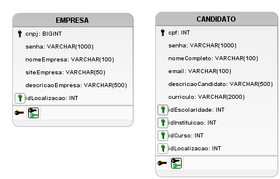
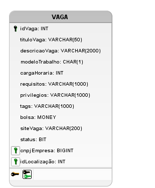

# Introdução

Este documento tem como objetivo descrever as mudanças feitas na modelagem do banco de dados, mudanças estas que foram necessárias, pois durante a criação da API e das requisições HTTP foram verificadas discrepâncias entre a [modelagem do banco de dados](../../Modelagem/IE/ModelagemDeDados.md) e as regras de negócio da nossa aplicação, logo, fazendo-se de extrema importância adequar a modelagem do banco de dados.

# Metodologia

A primeira discrepância verificada foi em relação ao cadastro e login dos perfis de 'Candidato' e 'Empresa', que percebemos que não guardávamos o atributo 'senha' no banco, desta maneira as entidades 'CANDIDATO' e 'EMPRESA' ficaram da seguinte maneira:

Figura 1: Entidades 'CANDIDATO' e 'EMPRESA' modificadas

A outra mudança feita na modelagem de dados foi na entidade 'VAGA', que foi a adição do atributo 'tags', que tem o objetivo de ajudar a realizar a busca por vagas por meio dos filtros. Além disso, mudamos também o tipo de dado do atributo 'bolsa', de 'DECIMAL' para 'MONEY', que é um tipo de dado aceito pelo SQL Server

logo, a entidade 'VAGA' ficou da seguinte maneira:

Figura 2: Entidade 'VAGA' modificada

# Bibliografia

> Microsoft. money e smallmoney (Transact-SQL). Disponível em <https://docs.microsoft.com/pt-br/sql/t-sql/data-types/money-and-smallmoney-transact-sql?view=sql-server-ver15>. Acessado em: 14 de abril de 2022

# Versionamento

Versão | Data | Modificação | Autor(es) |
|--|--|--|--|
|1.0|14/04/2022|Criação do documento de redefinições do Banco de Dados|Ian Fillipe|
|1.1|15/04/2022|Revisão do documento de redefinições do Banco de Dados|Gabriel Avelino e Hérya|