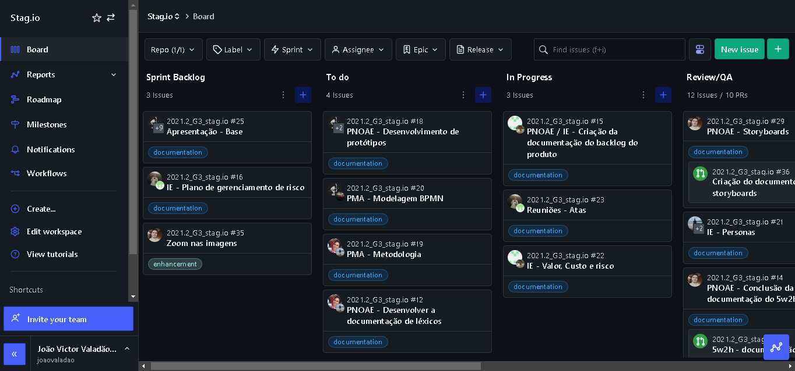

# Introdução

Este documento tem como objetivo retratar quais foram as metodologias utilizadas pela equipe durante a confecção do projeto, e quais os artefatos foram desenvolvidos a partir delas. Assim, o grupo se baseou em 3 metodologias principais para definir as práticas para o desenvolvimento da aplicação.

# Metodologia

## Scrum

Baseada nas boas práticas do desenvolvimento ágil, o Scrum foi desenvolvido para auxiliar equipes a trabalharem em conjunto, se organizando para resolverem um problema. Assim, essa metodologia descreve um conjunto de reuniões e cargos entre os integrantes para o gerenciamento do projeto, dividindo uma quantidade predefinida de tasks a serem concluídas dentro de um prazo estipulado que são chamadas Sprints. Dentre as práticas e conceitos do Scrum, o grupo optou em utilizar dos seguintes:

- **Scrum Master**: É o profissional responsável por garantir que as normas e regras sejam seguidas por todos os integrantes do grupo e desse modo orientar o grupo na hora do desenvolvimento dos documentos.

- **Sprints**: Dividindo quais tasks deveriam ser desenvolvidas no prazo estipulado, assim foram definidos reuniões para definir o planejamento e revisão das Sprints  (Review e Retrospective).

- **Daily**: O grupo se reunia diariamente durante a semana para discutirem e relatar possíveis problemas, onde aconteciam por meio do Discord ou Telegram.

Utilizando desses conceitos foram desenvolvidos os seguintes artefatos:

- **Product Backlog**: Lista com todas as funcionalidades desejadas para o produto.

- **Review e Retrospective**: Reuniões para definir como serão as próximas Sprints e revisar o que foi desenvolvido.

## Kanban

O Kanban ficou conhecido por ser um "cartão" que sinalizava o fim do processo produtivo, e início de uma nova etapa. Com o objetivo de facilitar o controle de produção e gestão de tarefas, o Kanban se mostrou extremamente útil para definir a prioridade e organização das tasks, por meio de um fluxo de trabalho.
O processo pode ser definido como um quadro branco separado por colunas, que permitem aos integrantes dividir o trabalho em segmentos menores por meio de cartões, onde são descritos as tasks, alocados na coluna apropriada. Assim, o grupo utilizou desses aspectos do Kanban através da extensão do ZenHub, onde o progresso de cada card poderia ser visualizado por cada integrante da equipe.

## eXtreme Programming

# Bibliografia

> - "Scrum". Disponível [aqui](https://www.atlassian.com/br/agile/scrum). Acesso em: 31 jan. 2022;
> - "Kanban: Conceito, como funciona, vantagens e implementação". Disponível [aqui](https://www.totvs.com/blog/negocios/kanban/#:~:text=O%20termo%20%E2%80%9CKanban%E2%80%9D%20%C3%A9%20de,ele%20se%20move%20pelo%20processo.). Acesso em: 02 fev. 2022;
> - [Documento Design Sprint do projeto Tá Na Mesa](https://github.com/UnBArqDsw2021-1/2021.1_G02_TaNaMesa_docs/blob/master/docs/1-Base/Processos-Metodologias-Abordagens/Metodologia.md);
> - [Documento Design Sprint do projeto Curumim](https://github.com/UnBArqDsw2021-1/2021.1_G6_Curumim/blob/main/docs/base/metodologia/metodologia.md);

# Versionamento

Versão | Data | Modificação | Autor(es) |
|--|--|--|--|
|1.0|31/01/2022|Abertura do documento|João Victor e Guilherme de Morais|
|1.1|02/02/2022|Metodologia Kanban|João Victor e Guilherme de Morais|