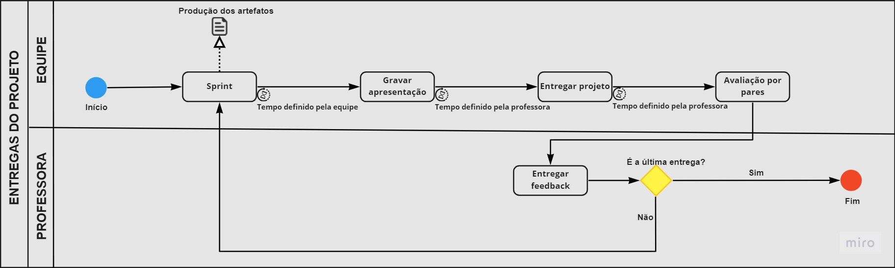
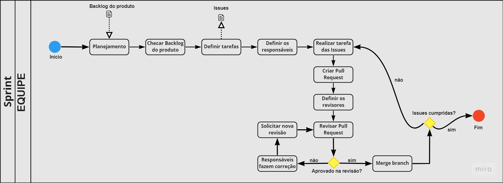

# Introdução

A notação BPMN, que quer dizer, Business Process Model and Notation (ou Modelo de Processo de Negócios e Notação, em português), representa um diagrama que pode ser usado para mapear todos os processos envolvidos em um projeto. Esse diagrama é construído seguindo uma coleção de regras na qual cada elemento dentro do mesmo possui um significado e um motivo para estar lá, e com isso essa notação de modelagem tem como objetivo criar um padrão para representar os processos de desenvolvimento de um produto.

# Metodologia

Nesse artefato buscamos representar os processos que fazem parte do desenvolvimento e do gerenciamento do nosso projeto. Sendo assim, decidimos representar os fluxos de Sprint e de entrega do projeto.  

<figcaption>Figura 1: Modelo BPMN que defini como será o processo de entregas do projeto</figcaption>

<figcaption>Figura 2: Modelo BPMN que defini como será as sprints da equipe</figcaption>

# Bibliografia

>SGANDERLA, K. Um guia para iniciar estudos em BPMN (I): Atividades e sequência. Disponível em: <http://blog.iprocess.com.br/2012/11/um-guia-para-iniciar-estudos-em-bpmn-i-atividades-e-sequencia/>. Acessado em: 02 de fev de 2022.

# Versionamento

Versão | Data | Modificação | Autor(es) |
|--|--|--|--|
| 1.0 | 02/02/2022 | Criação do documento | Guilherme Vial e Ian Ferreira |
| 1.1 | 02/02/2022 | Adição de tópicos | Guilherme Vial e Ian Ferreira |
