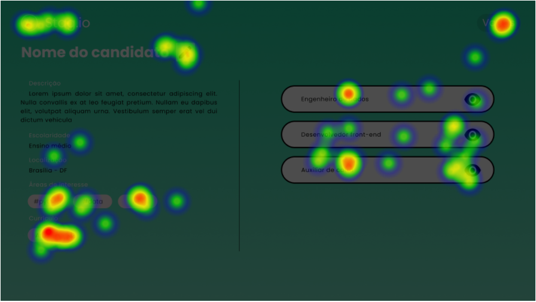

# Introdução

Tendo a preparação para a avaliação realizada, o grupo seguiu para a avaliação do protótipo de alta fidelidade, produzido na etapa anterior. O protótipo produzido integralmente no Figma, para facilitar a interação dos convidados à análise com este artefato.

Logo, o objetivo dessa avaliação é analisar e levantar o nível de qualidade que o protótipo de alta fidelidade foi construído. Assim, neste documento os avaliadores analisam o material registrado para atribuir significado aos dados coletados quando à experiência dos usuários aqui representados pelos entrevistados, quanto aos seus perfis.

Este documento é atribuído ao framework DECIDE predominantemente à atividade de letra E, que representa a fase de "evaluate", em português "avaliar". O avaliadores devem estar atentos a aspectos da avaliação realizada antes de tirar as conclusões e divulgar resultados, considerando principalmente o grau de confiabilidade dos dados, a validade externa do estudo e a validade ecológica do estudo.

# Metodologia

## Coleta de dados

Os cenários abordados já foram definidos no planejamento de avaliação e também as perguntas, os resultados dos dados coletados são listados abaixo

### Teste de login em uma conta

Tarefa: Gostaria que clicasse no botão de login, fizesse o login e depois visualizasse suas vagas

<iframe style="border: 1px solid rgba(0, 0, 0, 0.1);" width="800" height="450" src="https://www.figma.com/embed?embed_host=share&url=https%3A%2F%2Fwww.figma.com%2Fproto%2FM5weeLz4trCxIN3cC5g0U5%2FProt%25C3%25B3tipo-de-Alta-fidelidade%3Fnode-id%3D44%253A850%26scaling%3Dscale-down-width%26page-id%3D0%253A1%26starting-point-node-id%3D44%253A850" allowfullscreen></iframe>

Protótipo de login em uma conta

#### Heatmap

##### 1º Passo

##### 2º Passo

##### 3º Passo

##### 4º Passo

#### Resultados

### Teste com a perspectiva de um candidato que precisa de um estágio

Tarefa: Gostaria que você imaginasse que precisa de um estágio, clicasse no botão mais intuitivo, depois fizesse o cadastro

<iframe style="border: 1px solid rgba(0, 0, 0, 0.1);" width="800" height="450" src="https://www.figma.com/embed?embed_host=share&url=https%3A%2F%2Fwww.figma.com%2Fproto%2FM5weeLz4trCxIN3cC5g0U5%2FProt%25C3%25B3tipo-de-Alta-fidelidade%3Fnode-id%3D44%253A1046%26scaling%3Dscale-down-width%26page-id%3D0%253A1%26starting-point-node-id%3D44%253A1046" allowfullscreen></iframe>

Protótipo com a perspectiva de um candidato que precisa de um estágio

#### Heatmap

##### 1º Passo

##### 2º Passo

##### 3º Passo

#### Resultados

### Teste com a perspectiva de uma empresa que precisa de estagiários

Tarefa: 

- Imagine que você trabalhe em uma empresa que busca estagiários, qual o botão mais intuitivo que você clicaria?

- Após isto faça o cadastro da sua empresa;

- Adicione uma nova vaga de estágio.

<iframe style="border: 1px solid rgba(0, 0, 0, 0.1);" width="800" height="450" src="https://www.figma.com/embed?embed_host=share&url=https%3A%2F%2Fwww.figma.com%2Fproto%2FM5weeLz4trCxIN3cC5g0U5%2FProt%25C3%25B3tipo-de-Alta-fidelidade%3Fnode-id%3D54%253A1293%26scaling%3Dscale-down-width%26page-id%3D0%253A1%26starting-point-node-id%3D54%253A1293" allowfullscreen></iframe>

Protótipo com a perspectiva de uma empresa que precisa de estagiários

#### Heatmap

##### 1º Passo

##### 2º Passo

##### 3º Passo

##### 4º Passo

#### Resultados

### Teste com a perspectiva de um candidato se inscrever em alguma vaga

Tarefa: Gostaria que você fizesse o login no sistema, acessasse alguma das vagas disponíveis e se candidatasse a uma das vagas disponíveis.

<iframe style="border: 1px solid rgba(0, 0, 0, 0.1);" width="800" height="450" src="https://www.figma.com/embed?embed_host=share&url=https%3A%2F%2Fwww.figma.com%2Fproto%2FM5weeLz4trCxIN3cC5g0U5%2FProt%25C3%25B3tipo-de-Alta-fidelidade%3Fnode-id%3D44%253A1046%26scaling%3Dscale-down-width%26page-id%3D0%253A1%26starting-point-node-id%3D44%253A1046" allowfullscreen></iframe>

Protótipo com a perspectiva de um candidato se inscrever em alguma vaga

#### Heatmap

##### 1º Passo

##### 2º Passo

##### 3º Passo

##### 4º Passo

#### Resultados

## Avaliação dos resultados

Por meio dos resultados obtidos pudemos identificar os seguinte problemas:

- A tarefa não foi definida de uma maneira muito clara
- Identificar se uma demandas estava encerrada foi complexo
- Os locais onde se localizam os botões são intuitivos
- Por meio do heatmap percebemos que as pessoas tiveram uma maior assertividade nos botões desejados
- A média da intuitividade do usuário supera o valor 4, sendo muito boa pára afirmar que as sequências lógicas do sistema fazem sentido

# Bibliografia

> Barbosa, S. D. J.; Silva, B. S. da; Silveira, M. S.; Gasparini, I.; Darin, T.; Barbosa, G. D. J. (2021) Interação Humano-Computador e Experiência do usuário. Autopublicação. Nielsen, Jakob

> IBRAGIMOVA, E. High-fidelity prototyping: What, When, Why and How? Disponível em: <https://blog.prototypr.io/high-fidelity-prototyping-what-when-why-and-how-f5bbde6a7fd4>. Acesso em: 3 fev. 2022.

# Versionamento

Versão | Data | Modificação | Autor(es) |
|--|--|--|--|
|1.0|03/02/22|Criação do documento|Ítalo Vinícius|