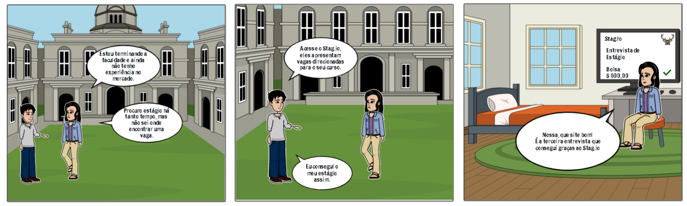
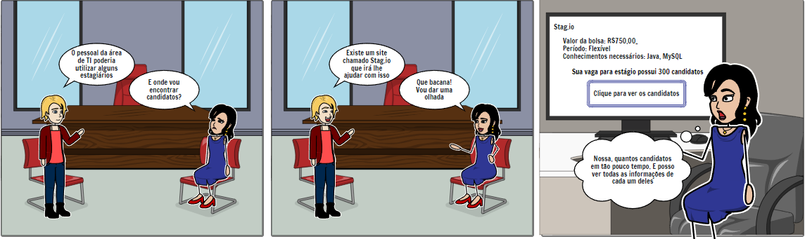
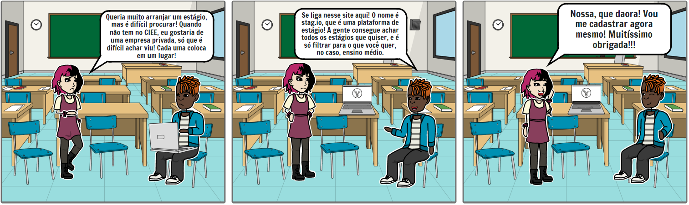
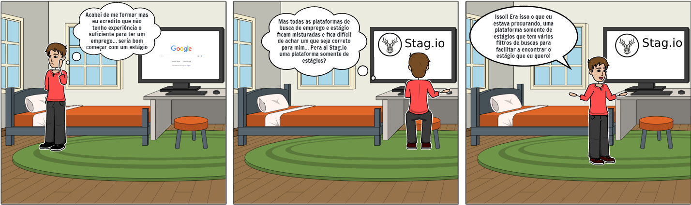

# Introdução

Os Storyboards ajudam a entender a interação produto-usuário no contexto e ao longo do tempo, facilitando visualmente quais requisitos podem ser elicitados através de ideias expressas em dois tipos de meios:

- Experiência: O leitor do storyboard pode visualizar as interações visualizadas por empatia com o usuário ou a situação, insto estabelece melhor uma conexão entre o produto e o usuário.

- Reflexão: O leitor pode refletir sobre as interações visualizadas a partir de sua própria experiência, afastando-se da experiência e olhando para o desdobramento do evento.

# Metodologia

A partir das personas construídas nesta documentação, pudemos identificar melhor o perfil de usuário compatível com o projeto e assim desenvolver os diferentes storyboards abaixo abordando situação diferentes para perfis diferentes, identificando possíveis requisitos que não vimos, podendo identificar melhor também requisitos não funcionais que ainda não elicitamos.

## Storyboard 1

Figura 1: Primeiro storyboard

Este storyboard é focado no estudante universitário que está em busca de um estágio.

## Storyboard 2

Figura 2: Segundo storyboard

Storyboard focando em uma empresa que busca estagiários de TI.

## Storyboard 3

Figura 3: Terceiro storyboard

Este storyboard foca em um aluno de ensino médio que busca estágio de jovem aprendiz. 

## Storyboard 4

Figura 4: Quarto storyboard

Este storyboard foca em uma pessoa já graduada que ainda não possui experiência.

# Bibliografia

> <a href="https://unbarqdsw2021-1.github.io/2021.1_G6_Curumim/base/requisitos/pre-rastreabilidade/5w2h/" target="_blank">Documentação do grupo Curumim</a>

> <a href="https://interacao-humano-computador.github.io/2020.2-Vjudge/designAvaliacaoDesenvolvimento/nivel1/storyboards/storyboards/" target="_blank">Documentação do grupo Vjudge da matéria de IHC</a>

> VAN DER LELIE, C. The value of storyboards in the product design process. Personal and Ubiquitous Computing, v. 10, n. 2–3, p. 159–162, abr. 2006. 

# Versionamento

Versão | Data | Modificação | Autor(es) |
|--|--|--|--|
|0.1|27/01/2022|Criação da documentação|Ítalo Vinícius|