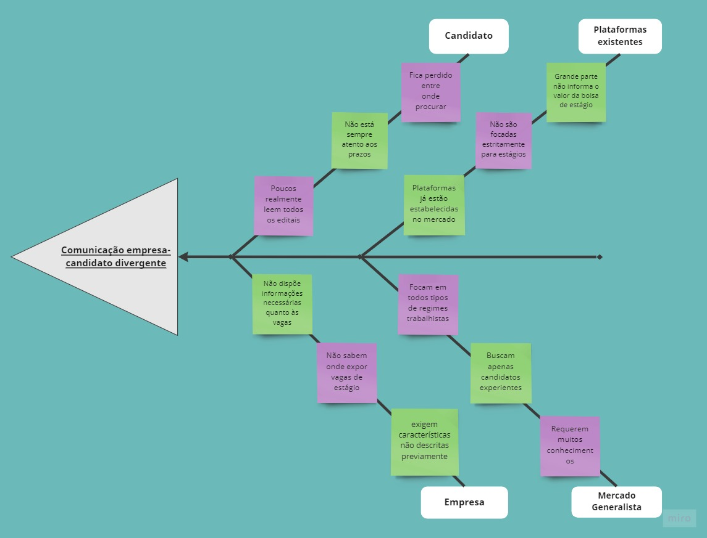

# Introdução

O diagrama Causa-Efeito (ou diagrama de Ishikawa ou espinha de peixe) são feitos para mostrar as possíveis causas e razões que corroboram para um problema definido. Este artefato visual foi inventado por Kaoru Ishikawa com a finalidade de que qualquer pessoas pudesse desenvolver de maneira rapida e fácil. 

# Metodologia

Com a equipe reunida, discutimos as principais causas e problemas sobre o nosso tema. Assim, utilizamos a ferramenta <a>miro.com</a> para realizar a formatação e construir o diagrama em forma de peixe abaixo.

## Diagrama Causa e Efeito

 

<figcaption> Figura 1 - Diagrama Causa e Efeito</figcaption>

# Bibliografia
> - ANDRADE, Luiza. Diagrama de Ishikawa: o que é e como fazer. Siteware, 2017. Disponível em: <https://www.siteware.com.br/blog/metodologias/diagrama-de-ishikawa/>. Último acesso em 27/01/2022.
> - "O que são os 6M no diagrama de causa e efeito?": [https://radardeprojetos.com.br/o-que-sao-os-6m-no-diagrama-de-causa-e-efeito/](https://radardeprojetos.com.br/o-que-sao-os-6m-no-diagrama-de-causa-e-efeito/). Último acesso em 28/01/2022.

# Versionamento

Versão | Data | Modificação | Autor(es) |
|--|--|--|--|
|1.0|28/01/2022|Abertura do documento|Ítalo Serra|
|1.0|28/01/2022|Criação do diagrama|Gabriel Avelino|