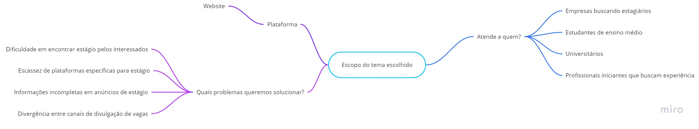
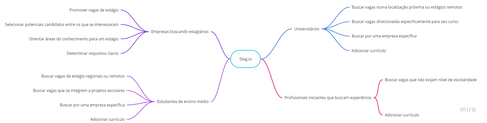

# Introdução

Um Mapa Mental é um diagrama que liga visualmente uma palavra chave, localizada no centro do diagrama, à palavras e conceitos relacionados, sendo que todas essa outra palavras também são ligadas a outras, criando assim um diagrama hierárquico de ideias.
A Mapa Mental é uma técnica muito utilizada, pois a partir dela todo o time pode passar por um processo criativo juntos.

Ele tem muitas aplicações, mas algumas coisas que adoramos usar são: brainstorming de ideias criativas, resolução de problemas, mapeamento de processos, criação de mapas de site visuais, criação de estruturas organizacionais e muito mais!

# Metodologia

Dentro do nosso escopo de desenvolvimento, toda a equipe se reuniu e desenvolveu na plataforma [Miro](https://miro.com/signup/) dois Mapas Mentais. 

O primeiro, representado na Figura 1, foi criado no intuito de definir o escopo do projeto, ou seja, definimos quais os principais problemas encontrados em plataformas que possuíam o tema parecido com o nosso projeto, definimos que tipo de projeto faremos, no caso decidimos por criar um site, e definimos quais os possíveis perfis de usuários do nosso projeto.

O segundo, representado na Figura 2, foi criado no intuito de definir as funções do nosso projeto, ou seja, definimos quais os principais problemas que resolveremos ou tentaremos mitigar.

Figura 1: Mapa Mental criado para definir o escopo do projeto

Figura 2: Mapa Mental criado para definir as funções do nosso projeto

# Bibliografia
>MIRO. The quick guide to mind mapping. Disponível em https://miro.com/guides/mind-mapping/. Acesso em: 01 fev. 2022.

# Versionamento

Versão | Data | Modificação | Autor(es) |
|--|--|--|--|
|0.1|01/02/2022|Criando o documento do Mapa Mental|Ian Ferreira|