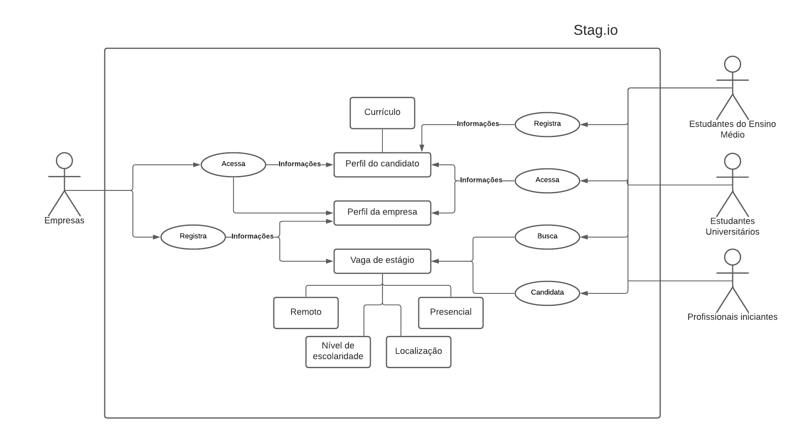

# Introdução

O conceito de um Rich Picture foi desenvolvido por Peter Checkland como parte de sua Soft Systems Methodology (SSM). SSM é uma abordagem para explorar problemas complexos e facilitar a mudança entre pessoas que possuem diferentes pontos de vista, objetivos e agendas. No SSM, Rich Pictures são usados como ferramentas para dar sentido a um sistema e seu comportamento.

# Metodologia

A partir da compreensão de o que são rich pictures, dividimos a equipe em diferentes trios e solicitamos que cada trio desenvolvesse seu próprio rich picture, com os rich pictures em mãos, aí sim nos reunimos para escolher o rich picture que mais refletia o pensamento de todos em relação ao projeto, todos os rich pictures estão listados abaixo.

## Rich Picture escolhido

O Rich Picture abaixo foi o que mais combinou com o que projeto realmente era, simbolizando de forma simples seu funcionamento e fluxo de uso.

Figura 1: Rich picture escolhido pela equipe

## Outros Rich pictures produzidos

Estes rich pictures também refletem o escopo do projeto, porém a imagem acima o reflete de maneira mais abrangente.

Figura 2: Rich picture do segundo trio

Figura 3: Rich picture do terceiro trio

# Bibliografia

> CONTE, K. P.; DAVIDSON, S. Using a ‘rich picture’ to facilitate systems thinking in research coproduction. Health Research Policy and Systems, v. 18, n. 1, p. 14, dez. 2020. 

> CHECKLAND, P. Soft systems methodology: a thirty year retrospective. Systems Research and Behavioral Science, v. 17, n. S1, p. S11–S58, 2000. 

# Versionamento

Versão | Data | Modificação | Autor(es) |
|--|--|--|--|
|1.0|28/01/2022|Criação da documentação|Ítalo Vinícius|
|1.0|02/02/2022|Revisão da documentação|Hérya e João|
