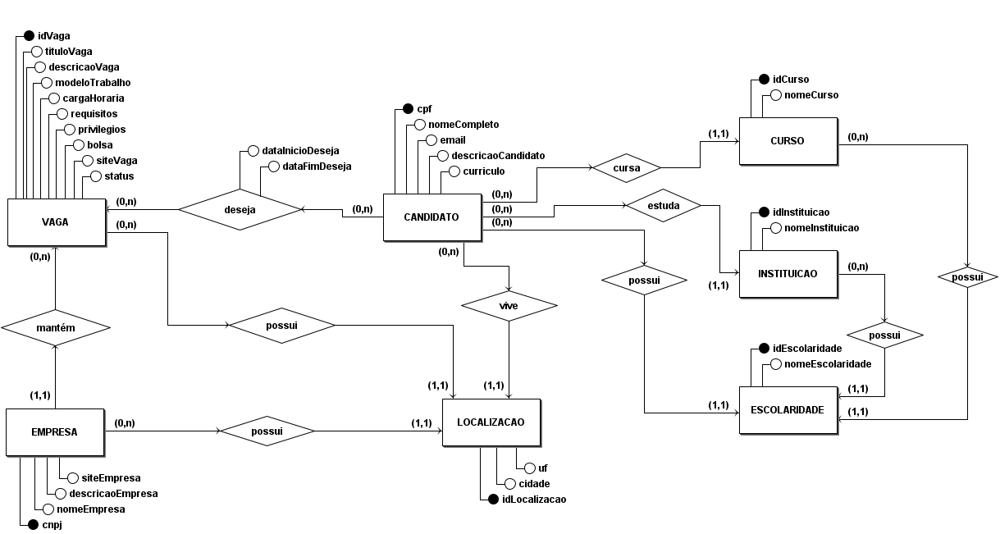

# Modelagem de Dados

## Introdução

A modelagem de dados é um processo muito importante do desenvolvimento de um software, pois está relacionado com a demonstração de como serão construídas as estruturas de dados que darão suporte aos processos de negócio, e como esses dados estarão organizados e quais relacionamentos podemos estabelecer entre eles. O principal papel da modelagem é descrever a abstração, que é o processo de trazer para o mundo digital as informações e requisitos que os clientes propuseram no mundo real, de modo a absorver o negócio de forma suficiente.

Essa modelagem é dividida entre conceitual, lógica e física. Neste documento, focaremos em demonstrar as duas primeiras etapas, a conceitual, com a documentação do Diagrama Entidade-Relacionamento, e a lógica, com o Diagrama Lógico de Dados e o Dicionário de Dados para complementá-lo.

## Modelo Entidade-Relacionamento (ME-R)

Neste nível são levantadas as entidades, que buscam representar objetos da vida real, os atributos, que são suas características e os relacionamentos, que são o que faz associação entre uma e outra entidade (representando a relação entre esses objetos no mundo real), possuindo cada um sua própria cardinalidade.

### Entidades

- <b>VAGA</b>
- <b>EMPRESA</b>
- <b>CANDIDATO</b>
- <b>LOCALIZACAO</b>
- <b>CURSO</b>
- <b>INSTITUICAO</b>
- <b>ESCOLARIDADE</b>

### Atributos

- <b>VAGA</b> (<u>idVaga</u>, tituloVaga, descricaoVaga, modeloTrabalho, cargaHoraria, requisitos, privilegios, bolsa, siteVaga, status, cnpjEmpresa, idLocalizacao)
- <b>EMPRESA</b> (<u>cnpj</u>, nomeEmpresa, siteEmpresa, descricaoEmpresa, idLocalizacao)
- <b>CANDIDATO</b> (<u>cpf</u>, nomeCompleto, email, descricaoCandidato, curriculo, idEscolaridade, idInstituicao, idCurso, idLocalizacao)
- <b>LOCALIZACAO</b> (<u>idLocalizacao</u>, cidade, uf)
- <b>CURSO</b> (<u>idCurso</u>, nomeCurso, idEscolaridade)
- <b>INSTITUICAO</b> (<u>idInstituicao</u>, nomeInstituicao, idEscolaridade)
- <b>ESCOLARIDADE</b> (<u>idEscolaridade</u>, nomeEscolaridade)

### Relacionamentos

- <b>CANDIDATO</b> deseja <b>VAGA</b> - Um <b>CANDIDATO</b> deseja uma ou várias <b>VAGA</b>, e uma <b>VAGA</b> é desejada por um ou vários <b>CANDIDATO</b>. Cardinalidade: <b>n:m</b>.
- <b>VAGA</b> possui <b>LOCALIZACAO</b> - Uma <b>VAGA</b> possui uma <b>LOCALIZACAO</b>, e uma <b>LOCALIZACAO</b> é possuída por uma ou várias <b>VAGA</b>. Cardinalidade: <b>n:1</b>.
- <b>EMPRESA</b> possui <b>LOCALIZACAO</b> - Uma <b>EMPRESA</b> possui uma <b>LOCALIZACAO</b>, e uma <b>LOCALIZACAO</b> é possuída por uma ou várias <b>EMPRESA</b>. Cardinalidade: <b>n:1</b>.
- <b>CANDIDATO</b> vive <b>LOCALIZACAO</b> - Um <b>CANDIDATO</b> vive em uma <b>LOCALIZACAO</b>, e uma <b>LOCALIZACAO</b> é vivida por um ou vários <b>CANDIDATO</b>. Cardinalidade: <b>n:1</b>.
- <b>EMPRESA</b> mantém <b>VAGA</b> - Uma <b>EMPRESA</b> mantém uma ou várias <b>VAGA</b>, e uma <b>VAGA</b> é mantida por uma <b>EMPRESA</b>. Cardinalidade: <b>1:n</b>.
- <b>CANDIDATO</b> possui <b>ESCOLARIDADE</b> - Um <b>CANDIDATO</b> possui uma <b>ESCOLARIDADE</b>, e uma <b>ESCOLARIDADE</b> é possuída por um ou vários <b>CANDIDATO</b>. Cardinalidade: <b>n:1</b>. 
- <b>CANDIDATO</b> estuda <b>INSTITUICAO</b> - Um <b>CANDIDATO</b> estuda em uma <b>INSTITUICAO</b>, e uma <b>INSTITUICAO</b> é onde estuda um ou vários <b>CANDIDATO</b>. Cardinalidade: <b>n:1</b>.
- <b>CANDIDATO</b> cursa <b>CURSO</b> - Um <b>CANDIDATO</b> cursa um <b>CURSO</b>, e um <b>CURSO</b> é cursado por um ou vários <b>CANDIDATO</b>. Cardinalidade: <b>n:1</b>.
- <b>CURSO</b> possui <b>ESCOLARIDADE</b> - Um <b>CURSO</b> possui uma <b>ESCOLARIDADE</b>, e uma <b>ESCOLARIDADE</b> é possuída por um ou vários <b>CURSO</b>. Cardinalidade: <b>n:1</b>.

## Diagrama Entidade-Relacionamento (DE-R)

Figura 1: Diagrama Entidade-Relacionamento

## Diagrama Lógico de Dados (DLD)

Figura 2: Diagrama Lógico de Dados

## Dicionário de Dados

Entidade: **VAGA**

Descrição: **Define os dados de uma vaga de estágio sob processo seletivo.**

|  Atributo  | Propriedades do atributo |            Tipo de Dado           |  Tamanho   |                         Descrição                         |
| :--------: | :--------------------: | :---------------------------------: | :--------: | :-------------------------------------------------------: |
|idVaga|chave primária, obrigatório|int|-|Identificador de uma vaga.|
|tituloVaga|obrigatório|varchar|50|Título reduzido de uma vaga.|
|descricaoVaga|obrigatório|varchar|1000|Descrição detalhada de uma vaga.|
|modeloTrabalho|obrigatório|enum(‘Presencial’,’Remoto’,’Híbrido’)|-|Modelo de trabalho, sendo dividido entre presencial, remoto e híbrido.|
|cargaHoraria|obrigatório|int|-|Carga horária de trabalho de uma vaga.|
|requisitos|obrigatório|varchar|1000|Requisitos solicitados por uma vaga. |
|privilegios|obrigatório|varchar|1000|Privilégios concedidos por uma vaga.|
|bolsa|obrigatório|decimal|6,2|Valor monetário da bolsa concedida pela vaga.|
|siteVaga|obrigatório|varchar|200|Site em que está hospedado o processo da vaga.|
|status|obrigatório|boolean|-|Situação de uma vaga, sendo “true” = ativada e “false” = inativada.|
|cnpjEmpresa|obrigatório|bigint|-|CNPJ da empresa que é proprietária de uma vaga.|
|idLocalizacao|chave estrangeira, obrigatório|int|-|Identificador da localização de trabalho de uma vaga.|

Entidade: **EMPRESA**

Descrição: **Define os dados de uma empresa que pode contratar estagiários.**

|  Atributo  | Propriedades do atributo |            Tipo de Dado           |  Tamanho   |                         Descrição                         |
| :--------: | :--------------------: | :---------------------------------: | :--------: | :-------------------------------------------------------: |
|cnpj|chave primária, obrigatório|bigint|-|Número do CNPJ de uma empresa.|
|nomeEmpresa|obrigatório|varchar|100|Nome de uma empresa.|
|siteEmpresa|obrigatório|varchar|200|Site próprio da empresa.|
|descricaoEmpresa|obrigatório|varchar|1000|Descrição detalhada de uma empresa.|
|idLocalizacao|chave estrangeira, obrigatório|int|-|Identificador da localização de uma empresa|

Entidade: **LOCALIZACAO**

Descrição: **Define os dados de uma localização dentro do Brasil.**

|  Atributo  | Propriedades do atributo |            Tipo de Dado           |  Tamanho   |                         Descrição                         |
| :--------: | :--------------------: | :---------------------------------: | :--------: | :-------------------------------------------------------: |
|idLocalizacao|chave primária, obrigatório|int|-|Identificador de uma localização.|
|cidade|obrigatório|varchar|50|Nome de uma cidade de uma localização.|
|uf|obrigatório|char|2|Sigla do estado de uma localização.|

Entidade: **CURSO**

Descrição: **Define os dados de um curso, seja universitário ou graus do ensino médio.**

|  Atributo  | Propriedades do atributo |            Tipo de Dado           |  Tamanho   |                         Descrição                         |
| :--------: | :--------------------: | :---------------------------------: | :--------: | :-------------------------------------------------------: |
|idCurso|chave primária, obrigatório|int|-|Identificador de um curso.|
|nomeCurso|obrigatório|varchar|50|Nome de um curso.|
|idEscolaridade|chave estrangeira, obrigatório|int|-|Identificador de escolaridade de um curso.|

Entidade: **INSTITUICAO**

Descrição: **Define os dados de uma instituição de ensino.**

|  Atributo  | Propriedades do atributo |            Tipo de Dado           |  Tamanho   |                         Descrição                         |
| :--------: | :--------------------: | :---------------------------------: | :--------: | :-------------------------------------------------------: |
|idInstituicao|chave primária, obrigatório|int|-|Identificador de uma instituição.|
|nomeInstituicao|obrigatório|varchar|100|Nome de uma instituição de ensino.|
|idEscolaridade|chave estrangeira, obrigatório|int|-|Identificador de escolaridade de uma instituição.|

Entidade: **ESCOLARIDADE**

Descrição: **Define os dados de um nível de escolaridade.**

|  Atributo  | Propriedades do atributo |            Tipo de Dado           |  Tamanho   |                         Descrição                         |
| :--------: | :--------------------: | :---------------------------------: | :--------: | :-------------------------------------------------------: |
|idEscolaridade|chave primária, obrigatório|int|-|Identificador de uma escolaridade.|
|nomeEscolaridade|obrigatório|varchar|50|Nome de uma escolaridade.|

Entidade: **CANDIDATO**

Descrição: **Define os dados de um estudante candidato a estagiário.**

|  Atributo  | Propriedades do atributo |            Tipo de Dado           |  Tamanho   |                         Descrição                         |
| :--------: | :--------------------: | :---------------------------------: | :--------: | :-------------------------------------------------------: |
|cpf|chave primária, obrigatório|int|-|Número do documento de CPF de um candidato.|
|nomeCompleto|obrigatório|varchar|200|Nome de um candidato.|
|email|obrigatório|varchar|100|Email de um candidato.|
|descricaoCandidato|optativo|varchar|1000|Descrição detalhada de um candidato.|
|curriculo|optativo|blob|-|Arquivo do currículo de um candidato.|
|idEscolaridade|chave estrangeira, obrigatório|int|-|Identificador da escolaridade de um candidato.|
|idInstituicao|chave estrangeira, obrigatório|int|-|Identificador da instituição de ensino de um candidato. |
|idCurso|chave estrangeira, obrigatório|int|-|Identificador do curso de um candidato. |
|idLocalizacao|chave estrangeira, obrigatório|int|-|Identificador da localização de um candidato. |

Relacionamento: **deseja**

Descrição: **Define relacionamento que corresponde a um candidato desejar (aplicar a) uma vaga, com cardinalidade _n:m._**

|  Atributo  | Propriedades do atributo |            Tipo de Dado           |  Tamanho   |                         Descrição                         |
| :--------: | :--------------------: | :---------------------------------: | :--------: | :-------------------------------------------------------: |
|cpfCandidato|chave estrangeira, obrigatório|int|-|Número do CPF de um candidato.|
|idVaga|chave estrangeira, obrigatório|int|-|Identificador de uma vaga que um candidato deseja.|
|dataInicioDeseja|obrigatório|date|-|Data de início de desejo em uma vaga.|
|dataFimDeseja|optativo|date|-|Data de fim de desejo em uma vaga.|

# Bibliografia

> - Modelagem de dados. SAE UnB. Disponível [aqui](https://sae.unb.br/cae/conteudo/unbfga/sbd/new_bancomodelagem.html). Acesso em: 15 fev. 2022;

# Versionamento

Versão | Data | Modificação | Autor(es) |
|--|--|--|--|
| 1.0 | 16/02/2022 |Criação do documento | Guilherme de Morais e Ian Ferreira |
| 1.1 | 18/02/2022 |Correção de erros no Dicionário de Dados | Guilherme de Morais |