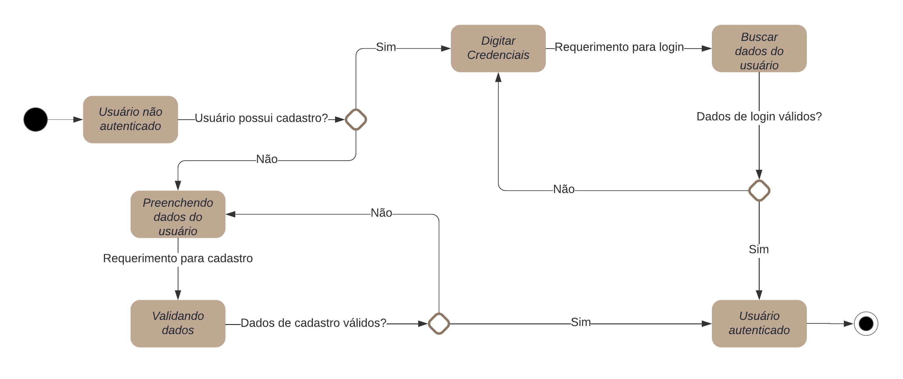
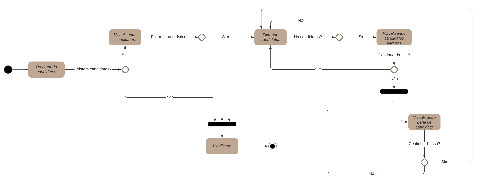
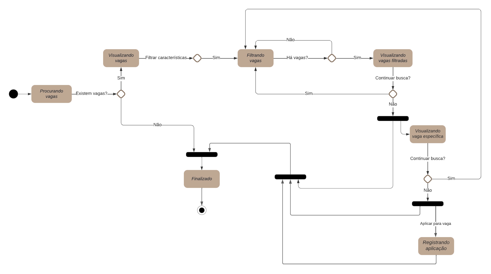
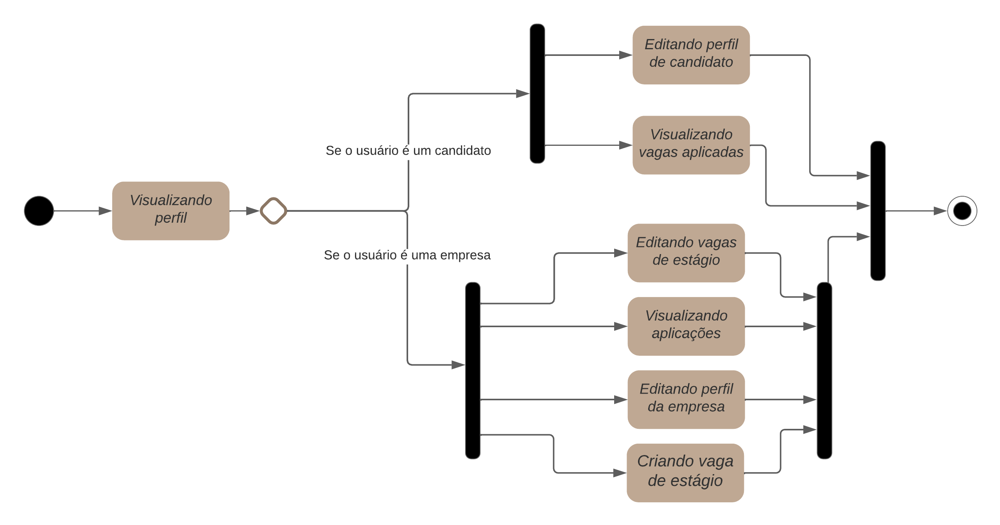

# Introdução

O Diagrama de Estados é um tipo de diagrama UML dinâmico que mostra os vários estados possíveis pelos quais um objeto pode passar ao longo do tempo. Nesse tipo de diagrama, o estado do objeto muda quando ocorre um evento interno ou externo ao sistema. Desta forma, os diagramas de estado permitem descrever todos os prováveis estados de um sistema e os possíveis eventos que resultam na transição de um estado para outro.

# Metodologia
## Elementos de um diagrama de estados
* Estado: indica a natureza do objeto em determinado momento; 
* Estado inicial: é o primeiro estado do processo;
* Estado final: indica que um processo foi terminado;
* Ações: processo associado à transição de estados. As ações podem ser classificadas em:
    * Ações de entrada: executadas ao chegar ao estado;
    * Ações de saída: executadas ao sair do estado;
    * Ações de atividade: executadas dentro do estado;
* Eventos/Transições: representa a mudança de um estado devido às ações externas sobre um objeto.

# Diagramas

**Realização de Login**

<figcaption> Figura 1 - Diagrama de autenticação  </figcaption>

**Busca por candidatos**

<figcaption> Figura 2 - Diagrama de busca de candidatos  </figcaption>

**Busca por vagas**

<figcaption> Figura 3 - Diagrama de busca por vagas  </figcaption>

**Ver perfil**

<figcaption> Figura 4 - Diagrama de perfil  </figcaption>

# Bibliografia

> BARCELAR, Ricardo Rodrigues. Modelagem de sistemas orientada a objetos com UML. 

> Documentação Curumim, 2021. Diagrama de Estados. Disponível em: <https://unbarqdsw2021-1.github.io/2021.1_G6_Curumim/modelagem/modelagem-dinamica/diagrama-estados/>. Acesso em: 14 de fevereiro de 2022. 

> O que é um diagrama de máquina de estados? LucidChart Disponível em: <https://www.lucidchart.com/pages/pt/o-que-e-diagrama-de-maquina-de-estados-uml>. Acesso em: 14 de fevereiro de 2022. 

> State Machine Diagrams. UML Diagrams. Disponível em: <https://www.uml-diagrams.org/state-machine-diagrams.html>. Acesso em: 14 de fevereiro de 2022.

# Versionamento

Versão | Data | Modificação | Autor(es) |
|--|--|--|--|
|1.0|15/02/2022|Elaboração de introdução e metodologia| Hérya|
|1.1|15/02/2022|Adição dos diagramas| Hérya, Guilherme Vial |
|1.2|18/02/2022|Corrigindo diretório das imagens|Ítalo V.|
