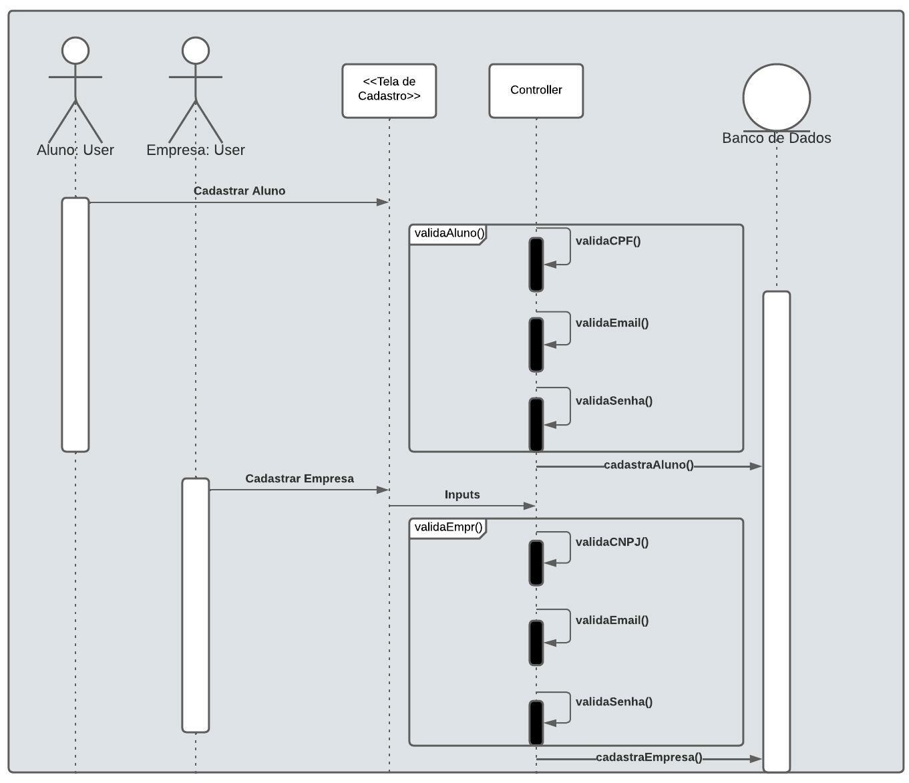
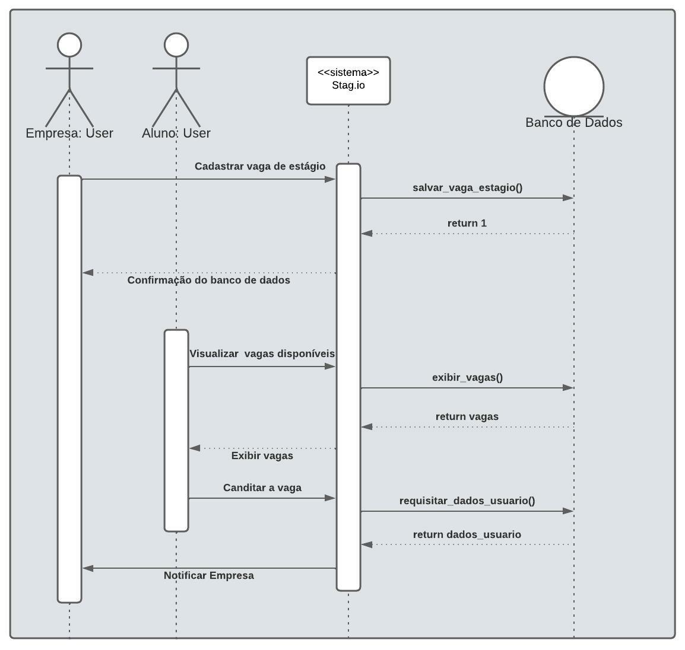

# Introdução

O diagrama de sequência tem o objetivo de representar um conjunto de objetos que estão interagindo ao longo do funcionamento da aplicação, descrevendo como esses grupos de objetos colaboram entre si em cada caso de uso. Desse modo, é criado um registro do comportamento e das mensagens trocadas entre esses objetos, determinando a sequência que essas ações ocorrem dentro dos processos.

Esses diagramas são utilizados por desenvolvedores de software para facilitar o entendimento de um sistema, identificando quais métodos são disparados quando uma ação é escolhida por um "ator" ou objetos que se encontram nesse sistema, e assim representar graficamente o comportamento da aplicação durante uma funcionalidade.

# Metodologia

Utilizando a notação UML, o nosso grupo optou por utilizar a plataforma <a href="https://www.lucidchart.com/pages/" target="_blank">Lucidchart</a> já que esta disponibiliza os pacotes e as ferramentas básicas de um diagrama de sequência, além de simplificar a lógica das operações e funções da aplicação e permitir que vários integrantes modifiquem o diagrama simultaneamente.

# Diagramas
## Cadastro de Usuário

<figcaption>Figura 1: Diagrama de Sequência - Cadastro de Usuário</figcaption>

## Candidatar em uma vaga de estágio

<figcaption>Figura 2: Diagrama de Sequência - Candidatar em uma vaga de estágio</figcaption>

# Bibliografia

> - "Diagrama de Esquemas UML". Disponível [aqui](https://support.microsoft.com/pt-br/office/criar-um-diagrama-de-sequ%C3%AAncia-uml-c61c371b-b150-4958-b128-902000133b26). Acesso em: 11 fev. 2022;
> - "O que é um Diagrama de Esquemas?". Disponível [aqui](https://www.lucidchart.com/pages/pt/o-que-e-diagrama-de-sequencia-uml). Acesso em: 11 fev. 2022;
 
# Versionamento

Versão | Data | Modificação | Autor(es) |
|--|--|--|--|
|1.0| 11/02/2022 | Abertura do Documento | João Victor |
|1.1| 14/02/2022 | Diagrama de cadastro | João Victor e Gabriel|
|1.2| 15/02/2022 | Diagrama de busca para vagas de estágio | João Victor e Gabriel|
|1.3| 17/02/2022 | Revisão do arquivo | Álvaro e Ítalo V.|