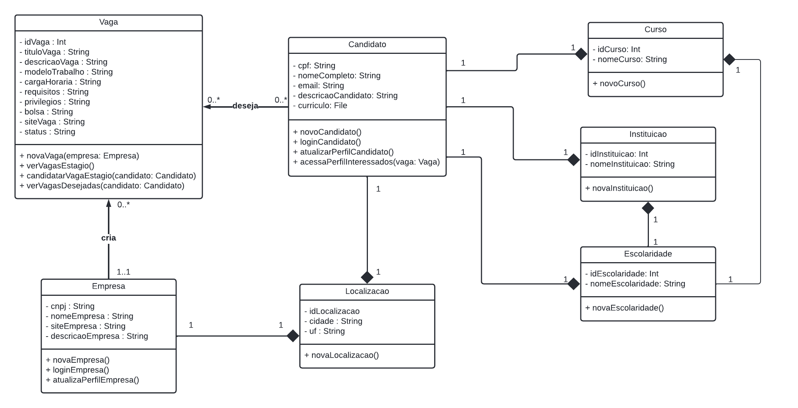

# Introdução

O Diagrama de Classes é um tipo de modelagem que tem como objetivo mostrar a estrutura de um sistema no nível de classes, ou seja, ele define quais as classes a aplicação terá, e define as suas características, restrições e relacionamentos.

Uma classe padrão tem um formato retangular e possui três partes principais:

- **Parte superior**, que define o nome da classe;
- **Parte central**, que define os atributos da classe;
- **Parte inferior**, que define as operações ou métodos da classe.

Além disso cada classe está ligada a uma outra por meio de um tipo de relacionamento específico. Os relacionamentos utilizados no Diagrama de Classes do nosso projeto, foram:

- **Composição:** que é representada por uma linha com um losango preenchido na ponta, e que define uma dependência forte entre as classes;
- **Associação:** que é representada por uma linha com uma seta preenchida na ponta, e que indica que a classe mantém uma referência a outra classe.

# Metodologia

Desenvolvemos o Diagrama de Classes utilizando o site [Lucidchart](https://www.lucidchart.com/pages/), e para a sua criação, partimos do que definimos nos [requisitos elicitados](../../Base/PNOAE/Requisitos/Rastreabilidade/MatrizRastreabilidade.md), no [protótipo de alta fidelidade](../../Base/PNOAE/DesignSprint/Prototipacao/PrototipoAltaFidelidade.md) e principalmente, na [modelagem de dados](../IE/ModelagemDeDados.md)

Figura 1: Diagrama de Classes

# Bibliografia

>UML Class and Object Diagrams Overview. Disponível em: <https://www.uml-diagrams.org/class-diagrams-overview.html>. Acessado em: 16 de fev. de 2022.

>O que é um diagrama de classe UML?. Disponível em: <https://www.lucidchart.com/pages/pt/o-que-e-diagrama-de-classe-uml>. Acessado em: 16 de fev. de 2022.

# Versionamento

Versão | Data | Modificação | Autor(es) |
|--|--|--|--|
| 1.0 | 16/02/2022 |Criação do documento | Guilherme de Morais e Ian Ferreira |

