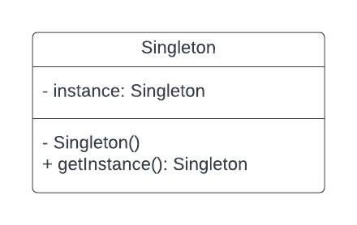
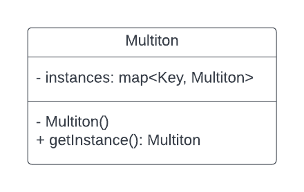

# Introdução

# Metodologia

## Padrões criacionais

### Sigleton

#### **Definição**

Alguns projetos necessitam que algumas classes tenham apenas uma instância. O padrão Singleton garante a existência de apenas uma instância de uma classe, mantendo um ponto global de acesso ao seu objeto.

#### **Uso no projeto**

Em nosso projeto, o padrão poderá ser aplicado para garantir a criação de apenas uma instância da aplicação e do banco de dados, garantindo que não haja perda de desempenho.

##### Modelagem

[](../../assets/PadroesDeProjeto/SingletonModelagem.png)


##### Código

A própria função construtora MyApp é responsável por garantir o retorno da mesma instância do objeto sempre que for invocada, ou criar uma nova instância caso ainda não exista.

```javascript
function MyApp() {
  if (!MyApp.instance) {
    MyApp.instance = this;
  }

  return MyApp.instance;
}
```

### Multiton

#### **Definição**

É a generalização do padrão Singleton. O padrão Multiton permite a criação controlada de múltiplas instâncias.

#### **Uso no projeto**

O padrão multiton será utilizado em nosso projeto com o objetivo de limitar as instâncias dos objetos de vaga por aplicação. Decidimos limitar a quantidade de objetos em razão da segurança em SPAM.

##### Modelagem

[
](https://i.imgur.com/bdjBzTy.png)

[](../../assets/PadroesDeProjeto/MultitonModelagem.png)

#### Código

```javascript
function getMultiton(string key) {
    if (!instances.isFull()){
        if (!instances.ContainsKey(key)) {
            instances.Add(key, new Multiton());
        }
    }
    return instances[key];
}
```

## Padrões estruturais

As interações entre objetos de um sistema pode causar grande dependência entre os elementos, de forma a aumentar a complexidade de eventuais alterações no funcionamento do sistema. Padrões estruturais estão preocupados com como classes e objetos são compostos para formar estruturas maiores e procuram diminuir o acoplamento entre os objetos de um sistema orientado a objetos.


### Facade

#### **Definição**

A Facade (fachada) fornece uma interface simplificada unificada de nível superior para um conjunto de interfaces em um sistema. Este padrão de projeto oculta a complexidade de uma ou mais classes através de uma Facade, possibilitando a simplificação da utilização de um subsistema complexo ao implementar uma classe que fornece uma interface única e mais razoável.


#### **Uso no projeto**

O padrão Facade será utilizado no contexto do projeto na omissão de alguns componentes do front-end, como uma Navbar em uma Home, por exemplo.


##### Modelagem


<figcaption> Figura 3 - Representação da utilização de Facade  </figcaption>


##### Código

```javascript
import React, { Component } from 'react';
import NavBar from 'components/NavBar';
```

### Proxy

#### **Definição**


O proxy permite controlar as chamadas e o acesso a um objeto original através de outro objeto de mesma interface. O proxy age como um intermediário entre o solicitante, que faz a requisição, e o provedor, que entrega as respostas à requisição.


#### **Uso no projeto**

As solicitações do banco de dados serão encapsuladas por meio da API para que o usuário não tenha acesso ao banco diretamente.

##### Modelagem


<figcaption> Figura 4 - Representação da utilização de Proxy  </figcaption>

##### Código

```javascript
import API from './config.js'

export default{
    loadCompanyProfile:() => {
        return API.get('/company_profile')
    }
}
```


## Padrões comportamentais

### Observer

#### **Definição**

Observer é um padrão de projeto  que permite que você defina um mecanismo para notificar múltiplos objetos sobre quaisquer mudanças que aconteçam com objetos que eles estão observando.

#### **Uso no projeto**

O padrão Observer será utilizado quando o usuário se candidata a uma vaga e ele precisa ser notificado em relação a atualizações da vaga. Ex.: Quando a vaga já foi preenchida ou se algum requisito foi alterado.

##### Modelagem


<figcaption> Figura 5 - Representação da utilização do Observer  </figcaption>


##### Código
``` javascript 
class Subscriber {

    constructor() {
      this.candidatos = [];
    }

    subscribe( candidato ){
        const subExists = this.candidatos.include(candidato)
        if (!subExists) this.candidatos.push(candidato)
    }

    unsubscribe( candidato ) {
      this.candidatos = this.candidatos.filter(item => item !== candidato);
    }

    notifySubscribers(data, typeChange) {
      this.candidatos.forEach(candidato => candidato.sendMailUpdates( data, typeChange ));
    }
  }
```


### Command

#### **Definição**

O padrão de projeto Command visa encapsular invocação, solicitações ou operações de método em um único objeto e nos dá a capacidade de parametrizar e passar chamadas de método que podem ser executadas a nosso critério.

#### **Uso no projeto**

Será utilizado no projeto, por exemplo, nas ações que a empresa contrante tem em relação a vaga, podendo criar, apagar e alterar.

##### Código

```javascript
(function(){
    var empresa = {
        criarVaga: function(vaga) {
            if (!listaVagas.include(vaga)) listaVagas.push(vaga);
        },
        
        apagarVaga: function(vaga) {
            listaVagas = listaVagas.filter(item => item !== vaga);
        },

        alterarVaga: function(vaga){
            listaVagas.map( item => {
                if(item.id === vaga.id){
                    return {...item, nome: vaga.nome, requisitos: vaga.requisitos};
                }
                return item;
            });
        }
    };
})();
```


# Bibliografia

> Erich Gamma, Richard Helm, Ralph Johnson e John Vlissides. Design Patterns: Elements os Reusable Object Oriented Software. Addison-Wesley, 1995.
> SERRANO, Milene. Módulo Padrões de Projeto GoFs - Material em Slides. Acesso em 17 de março de 2022.

# Versionamento

Versão | Data | Modificação | Autor(es) |
|--|--|--|--|
|1.0|16/03/2022|Criando template do documento|Ítalo V., Hérya, Guilherme Vial, Nathan|
|2.0|17/03/2022|Adição de padrões criacionais|Guilherme Vial|
|3.0|18/03/2022|Adição de padrões estruturais|Hérya|
