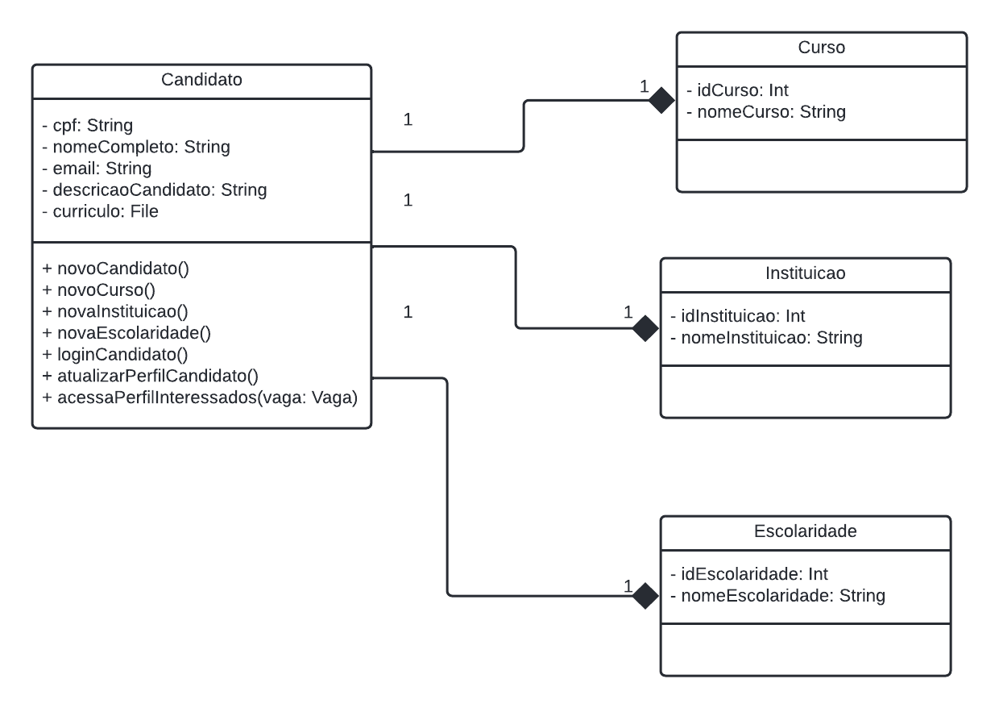
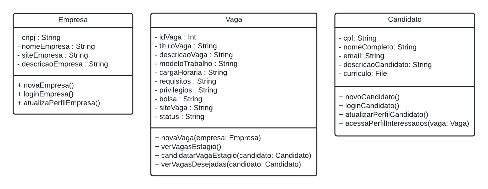
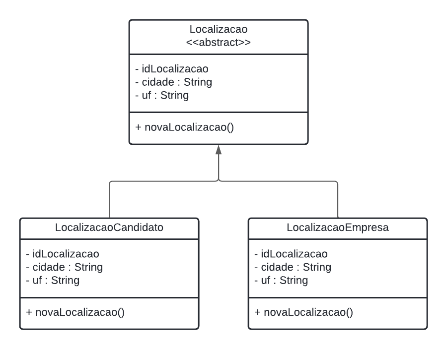

# Introdução

GRASP, que é uma sigla que significa General Responsibility Assignment Software Patterns (ou traduzido, Padrões de Software de Atribuição de Responsabilidade Geral), representa um conjunto de padrões de projeto, que estão relacionados principalmente com as responsabilidades que as classes possuem em um projeto.

Esse conjunto é separado em 9 padrões diferentes que são:

- Criador (Creator)
- Especialista (Information Expert)
- Alta Coesão (High Cohesion)
- Baixo Acoplamento (Low Coupling)
- Controlador (Controller)
- Polimorfismo (Polymorphism)
- Invenção/Fabricação Pura (Pure Fabrication)
- Indireção (Indirection)
- Variações Protegidas (Protected Variations)

# Metodologia

## Criador (Creator)

Esse padrão de projeto tem o objetivo de ser uma atividade mais comum para o projeto de sistemas orientados a objeto, já que possui uma função bastante básica e essencial para eles, que é, essencialmente, atribuir qual classe é responsável por criar quais objetos, elucidando em um exercício pelos projetistas esclarecer quem é responsável por criar uma nova instância de uma classe. Para isso, os projetistas devem atribuir à classe correta a responsabilidade de criar uma instância de outra classe, afim de **facilitar na compreensão do projeto** pelos desenvolvedores que dependem dessas definições de modelagem.

### Uso no projeto

No nosso projeto percebemos que esse padrão não estava sendo corretamente utilizado ainda na fase de modelagem, quando desenvolvemos o primeiro [Diagrama de Classes](../../Modelagem/ME/DiagramaDeClasse.md). Assim, para fazer o nosso projeto estar de acordo com este padrão, decidimos fazer algumas mudanças na modelagem, e uma delas é o exemplo abaixo:

- No relacionamento de composição entre as classes **Candidato** com **Curso**, **Instituicao** e **Escolaridade**, percebemos que após o estudo do padrão Criador e a busca por torná-lo uma prática do nosso projeto, a localização dos métodos **novoCurso**, **novaInstituicao** e **novaEscolaridade** estavam inadequados, visto que as instâncias das classes **Curso**, **Instituicao** e **Escolaridade** devem ser geradas logicamente pela classe **Candidato**.

Figura 1: Exemplo de relacionamento entre classes que decidimos aplicar o padrão Criador

### Justificativa

Decidimos que esse padrão seria bastante útil para usarmos na aplicação, pois percebemos que havia algumas inadequações a partir dos seus conceitos no nosso projeto, dificultando o entendimento lógico dos relacionamentos entre algumas classes. Logo, com sua utilização, resolvemos possíveis problemas que viriam a surgir nas próximas etapas do nosso desenvolvimento.

## Especialista (Information Expert)

Esse padrão define que uma responsabilidade deve ser atribuída a entidade mais especialista, ou seja, à classe que possui as informações necessárias para cumpri-la. Em nosso contexto, esse padrão tem o foco de ajudar a formular e a responder perguntas como: **"Faz sentido essa classe ter esse método?"**.

### Uso no projeto

No nosso projeto, percebemos que esse padrão seria útil não apenas em como seguiríamos na criação da aplicação daqui para frente, como também para avaliar se o que modelamos, principalmente no [Diagrama de Classes](../../Modelagem/ME/DiagramaDeClasse.md), fazia sentido. Nesse sentido, vimos que os métodos que criamos para as principais classes da nossa aplicação estavam de acordo com o que o padrão define:

- **novaVaga**: esse método está na classe **Vaga**, já que ela seria a classe especialista para guardar as próprias informações, mesmo que esse método tem que ser acessado pela classe **Empresa**;
- **candidatarVagaEstagio**: esse método está na classe **Vaga**, já que ela seria a classe especialista para tratar as principais informações que serão utilizadas para garantir a candidatura de alguém a vaga;
- **verVagasDesejadas**: esse método está na classe **Vaga**, já que ela seria a classe especialista para conter os dados que serão acessados pela classe **Candidato**;
- **acessaPerfilInteressados**: esse método está na classe **Candidato**, pois ela seria a classe especialista para guardar as próprias informações, mesmo que esse método tem que ser acessado pela classe **Empresa**;

Figura 2: Principais classes da aplicação, junto com os seus métodos

### Justificativa 

Decidimos que esse padrão seria útil para usarmos na aplicação, pois evitamos conexões implícitas entre classes, deixam as classes mais coesas, além do fato de que nos ajudou a avaliarmos as classes e métodos que havíamos criados.

## Alta Coesão (High Cohesion)

Esse padrão tem como princípio a criação de classes coesas, ou seja, classes que possuem como métodos, apenas aqueles relacionados à própria intenção da classe.

### Uso no projeto

Na nossa aplicação, esse padrão está sendo utilizado juntamente com o padrão Especialista, que tem como um dos focos, criar classes coesas. Nesse sentido, a utilização da alta coesão se encontra na definição dos métodos das classes, que podem ser vistos em nosso [Diagrama de Classes](../../Modelagem/ME/DiagramaDeClasse.md), e que também são explicitados no tópico anterior **Especialista (Information Expert)**

### Justificativa

O uso desse padrão é muito útil para o desenvolvimento de nossa aplicação, pois a Alta Coesão das classes do nosso software, facilita manutenções, reuso de classes ou componentes, e o facilidade de interpretação dos métodos de cada classe.

## Baixo Acoplamento (Low Coupling)

Esse padrão objetiva a utilização de uma boa prática que é o baixo acoplamento, que significa que uma classe não depende de outra, ou seja, mudar algo em uma classe não afeta as outras.

### Uso no projeto

Na nossa aplicação, para os princípios desse padrão, o baixo acoplamento se encontra na modelagem e relacionamento das principais classes do nosso [Diagrama de Classes](../../Modelagem/ME/DiagramaDeClasse.md), **Candidato**, **Vaga** e **Empresa**

- Em todos os relacionamentos, **Candidato** e **Vaga**, **Candidato** e **Empresa**, e **Vaga** e **Empresa**, utilizamos o Acoplamento de Dados, ou seja, passamos de uma classe para outra apenas os dados necessários para que esta classe faça seu trabalho.

### Justificativa

Vimos que esse padrão seria útil para usarmos no projeto, pois utilizando do baixo acoplamento, as classes se tornam mais independentes, facilitando assim a sua reutilização, além de que se tornam mais fáceis de testar, já que temos menos dependências para gerenciar.

## Controlador (Controller)

O padrão de projeto controlador tem o objetivo de atribuir objetos controladores ao projeto, que seria um objeto de interface não-usuário, responsável por receber ou manipular um evento do sistema, com uma classe que representa um cenário de caso de uso do sistema global. Nesse caso, ele é o primeiro objeto além da camada UI que recebe e coordena ("controla") operações do sistema, não devendo fazer por si próprio muito trabalho.

### Uso no projeto

Na nossa aplicação, o padrão controlador é exercido na utilização da arquitetura MVC, visto que as classes contidas na camada de controller servem como mediadoras entre as camadas view e model. No nosso projeto é possível verificar a sua utilização no [Diagrama de Pacotes](../../Modelagem/ME/DiagramaDePacotes.md), por meio do Express.JS.

### Justificativa

Optamos por utilizar esse padrão pois diminui a sensibilidade da camada de apresentação (view) em relação à lógica de domínio e também proporciona um melhor controle do estado do caso de uso;

## Polimorfismo (Polymorphism)

O padrão de projeto Polimorfismo é um velho conhecido para os projetos de sistemas orientados a objetos, sendo o princípio no qual classes derivadas de uma classe abstrata são capazes de importar para si métodos abstratos personalizados para se comportarem de maneiras diferentes nessas subclasses. A ideia geral é que a responsabilidade de definir a variação dos comportamentos com base no tipo é atribuída ao tipo para o qual essa variação ocorre, evitando o uso de instruções **if** ou **switch**, possibilitando que as seções de código se tornem menos acopladas e mais coesas.

### Uso no projeto

No nosso projeto percebemos que esse padrão não estava sendo corretamente utilizado ainda na fase de modelagem, quando desenvolvemos o primeiro [Diagrama de Classes](../../Modelagem/ME/DiagramaDeClasse.md). Assim, para fazer o nosso projeto estar de acordo com este padrão, decidimos fazer algumas mudanças na modelagem, e uma delas é o exemplo abaixo:

- Propusemos para a adaptação da nossa modelagem a este padrão de projeto a aplicação de polimorfismo na classe **Localizacao**, visto que para absorver a ideia que o domínio de traz de variação de comportamento seria necessário - da forma que está - gerar maior acoplamento e menor coesão para atribuir tal variação. Então, o que solucionaria tal problema seria criar uma classe abstrata para **Localizacao**, e duas subclasses que representam fielmente de forma coesa o que quisemos representar por conta do nosso domínio.

Figura 3: Exemplo de polimorfismo na classe Localizacao

### Justificativa

Vimos que esse padrão seria útil para usarmos no projeto, pois para manter o baixo acoplamento e alta coesão para solucionar a variação de comportamentos foi necessário utilizá-lo, criando classes abstratas e usando operações polimórficas, facilitando assim também a reutilização de código.

## Invenção/Fabricação Pura (Pure Fabrication)

A invenção pura é um padrão de projeto que tem o objetivo de basicamente preservar outros dois padrões já utilizados no projeto, que são a alta coesão e o baixo acoplamento. Ela é principalmente utilizada quando para a manutenção desses dois padrões, a utilização do padrão Especialista já não é suficiente. E para isso, somente criar classes a partir do conceito do domínio não é garantia de atender ao baixo acoplamento e alta coesão, no sentido que para atendê-los, o projetista cria uma classe artificial que não faz parte desse domínio, removendo características não coesas das classes de domínios de negócios, como por exemplo, a variação de comportamentos. 

### Uso no projeto

- Este GRASP foi utilizado de forma integrada quando buscamos utilizar no nosso projeto o padrão do Polimorfismo, como exemplo, inventando (ou fabricando) propriamente a classe abstrata **Localizacao** e suas subclasses **LocalizacaoEmpresa** e **LocalizacaoCandidato**, de modo a diminuir o acoplamento e melhorar a coesão.

### Justificativa

De forma integrada com os outros utilizados, este padrão foi útil para usarmos no projeto, pois somente utilizando dele conseguiríamos melhorar ainda mais a coesão e nível de acoplamento, já que outras alternativas de padrões, como o Especialista, não seriam suficientes.

## Indireção (Indirection)

A Indireção é um padrão que visa distribuir responsabilidades entre os componentes, evitando a vinculação direta entre eles. Sendo que, para isso, é atribuído a função de comunicação entre os componentes ou serviços a um componente intermediário.

### Uso no projeto

Na nossa aplicação, os componentes *controllers*, e *middlewares*, que foram modelados no nosso [Diagrama de Pacotes](../../Modelagem/ME/DiagramaDeComponentes.md), desempenharão o papel de intermediários, sendo que o primeiro fará a comunicação entre as *pages* do *Frondend* com as *models* do *Backend*, enquanto que a segunda servirá como intermediária, fazendo a conexão entre os dados, os usuários e a aplicação.

### Justificativa

Esse padrão é importante para o nosso projeto, pois seguindo ele, conseguimos garantir segurança na nossa aplicação, flexibilidade no código, além de garantir também reutilização.

## Variações Protegidas (Protected Variations)

Assim como no caso da Invenção pura, as Variações protegidas são um princípio básico na motivação de grande parte dos outros padrões de projeto - especialmente aqui, o polimorfismo. Aqui a ideia principal é que os outros padrões forneçam flexibilidade e proteção contra variações, ao identificar pontos de variação e atribuir responsabilidades para criar uma interface estável em volta desses pontos. O objetivo é evitar que ocorra a expansão de impactos de um para outros elementos, envolvendo o foco de instabilidade com uma interface e usando polimorfismo para criar várias implementações desta interface.

### Uso no projeto

- Este GRASP foi utilizado de forma integrada quando buscamos utilizar no nosso projeto o padrão do Polimorfismo, como exemplo, utilizando da classe abstrata **Localizacao** e suas subclasses **LocalizacaoEmpresa** e **LocalizacaoCandidato**, de modo a evitar que a variação desses objetos decaiam sobre impactos de alta instabilidade, baixa coesão e flexibilidade.A

### Justificativa

Esse padrão é importante para o nosso projeto, pois seguindo ele, conseguimos garantir a contenção de variações e instabilidades entre os objetos, diminuindo a expansão de impactos a outros elementos ao mesmo tempo que conseguimos melhorar a coesão e nível de acoplamento.

# Bibliografia

> Rodin, Vladislav. GRASP Patterns: Polymorphism, Pure Fabrication, Indirection, Protected Variations. Disponível <a href="https://prog.world/grasp-patterns-polymorphism-pure-fabrication-indirection-protected-variations/" target="_blank">aqui</a>. Acessado em: 15 de mar de 2022

> Gajda, Mateusz. Do you know GRASP? Part 2 - Indirection and Information expert. Disponível <a href="https://dev.to/mgce/do-you-know-grasp-part-2-indirection-and-information-expert-51i4" target="_blank">aqui</a>. Acessado em: 15 de mar de 2022

> Gajda, Mateusz. Do you know GRASP? Part 3 - Cohesion and Coupling. Disponível <a href="https://dev.to/mgce/do-you-know-grasp-part-3-cohesion-and-coupling-45ia" target="_blank">aqui</a>. Acessado em: 15 de mar de 2022

> SERRANO, Milene. Arquitetura e Desenho de Software - Aula GRASP_A. Disponível <a href="https://aprender3.unb.br/pluginfile.php/1558844/mod_label/intro/Arquitetura%20e%20Desenho%20de%20Software%20-%20Aula%20GRASP_A%20-%20Profa.%20Milene%20-%20Complementar.pdf" target="_blank">aqui</a>.  Acessado em: 14 de mar de 2022

> LARMAN, Craig. Utilizando UML e Padrões: Uma Introdução a Análise e ao Projeto Orientado a Objetos. 3a. edição. Bookman, 2007.

# Versionamento

Versão | Data | Modificação | Autor(es) |
|--|--|--|--|
|1.0|15/03/2022|Criando documento dos Padrões GRASPs |Guilherme e Ian|
|1.1|20/03/2022|Revisão do documento |Guilherme, Ian e Ítalo V.|