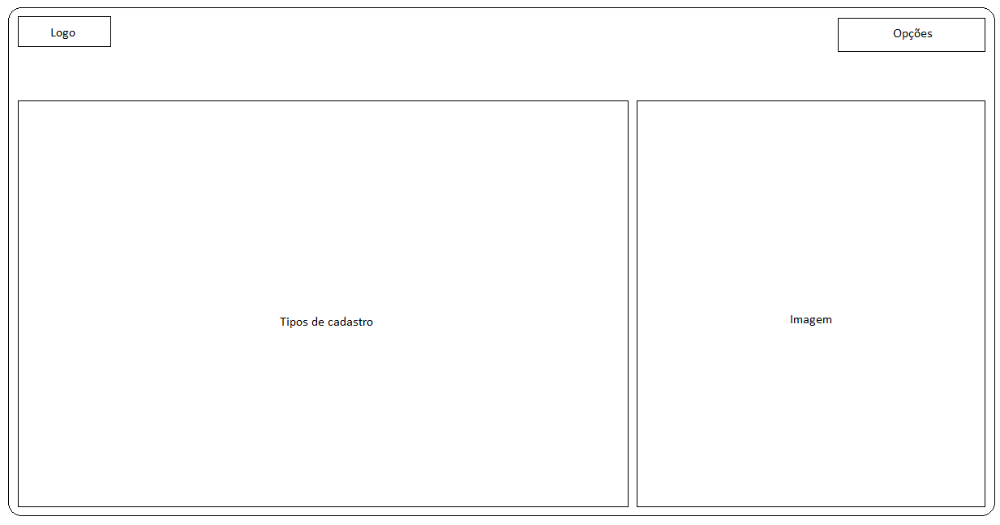
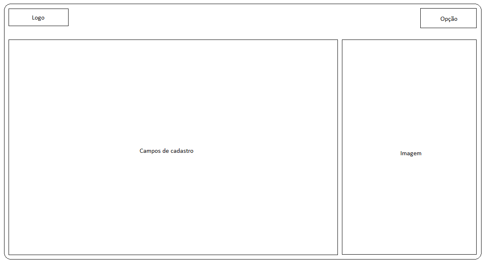
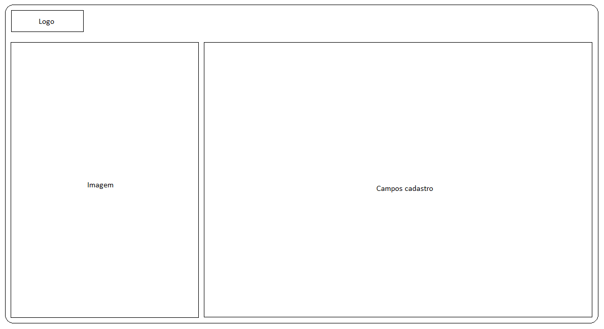
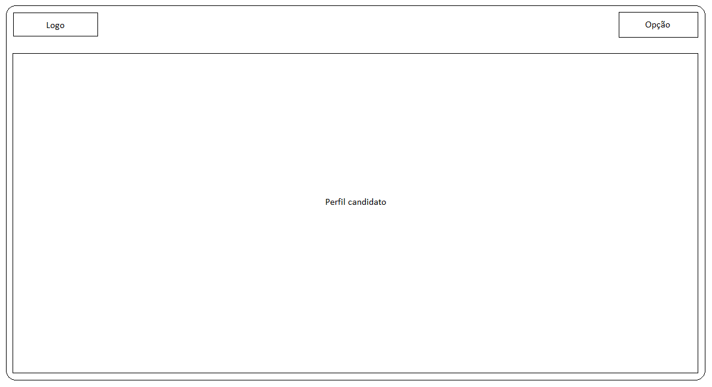
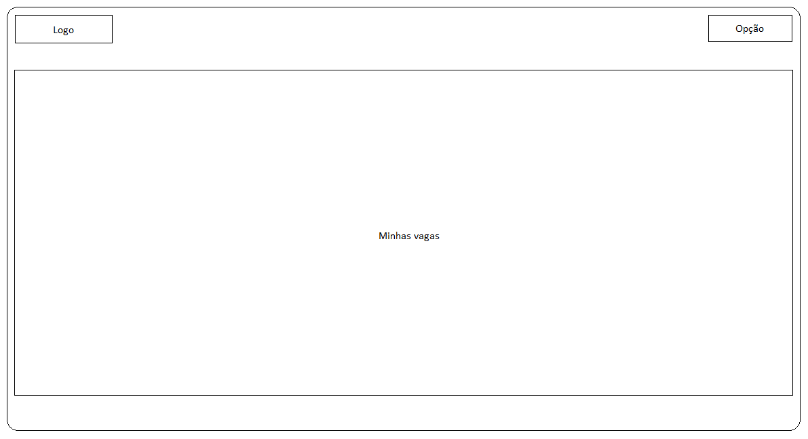
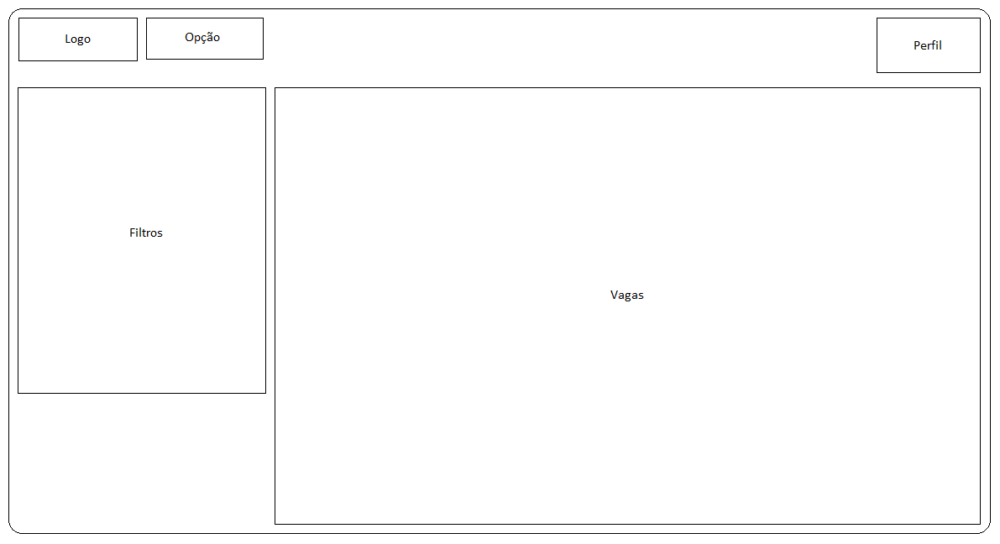
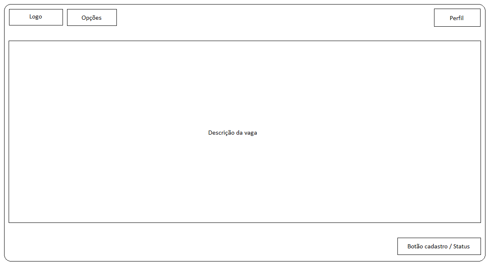

# Introdução

O guia de estilo representa as principais decisões e ideias de design que foram tomadas, com um conjunto de regras que busca auxiliar uma equipe a se manter alinhada quanto a aparência de todo um projeto, com o intuito de serem implementadas no produto final. Para o guia de estilo é definido a tipografia, as cores, os ícones e símbolos, espaçamentos, elementos de interface e também os elementos de ação. 

Entre os principais objetivos do guia de estilo estão: 

 - Servir como uma ferramenta de comunicação entre os membros da equipe de design e também com a equipe de desenvolvimento. 
 - Servir como uma base de consulta para que importantes decisões de design possam ser facilmente reutilizadas nas discussões sobre extensões ou versões futuras do produto.
 - Visualização com clareza para os membros da equipe de como ficará os designs do produto final.
 - Permitir uma consistência no desenvolvimento da interface e nos padrões das aplicações de design.

A organização do nosso guia de estilo será feito com base no livro Interação Humano Computador da autora Simone Barbosa e será orientado a partir do ciclo de vida Mayhew, o qual sugere que o guia de estilo tem que ser seguido ou modificado a cada nível de prototipagem.

O guia de estilo tem como público alvo os membros da equipe do projeto, para que possam se basear e construir o sistema com base nos designs definidos. Sendo atualizado e mantido com cada alteração de design feita pelos membros em reuniões.

# Elementos de interface

## Disposição espacial e grid

Figura 1: Tela Inicial

Figura 2: Cadastro Candidato

Figura 3: Cadastro Empresa

Figura 4: Perfil Candidato

Figura 5: Minhas Vagas

Figura 6: Vagas

Figura 7: Vaga

# Bibliografia

# Versionamento

Versão | Data | Modificação | Autor(es) |
|--|--|--|--|
| 1.0 | 14/03/2022 | Adição Inicial dos Elementos de Interface | Álvaro Leles |
| 1.0 | 15/03/2022 | Introduçao do documento | Gabriel Avelino |