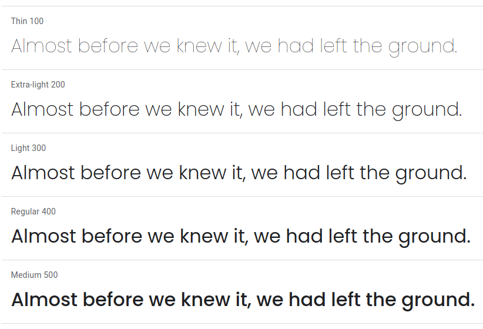
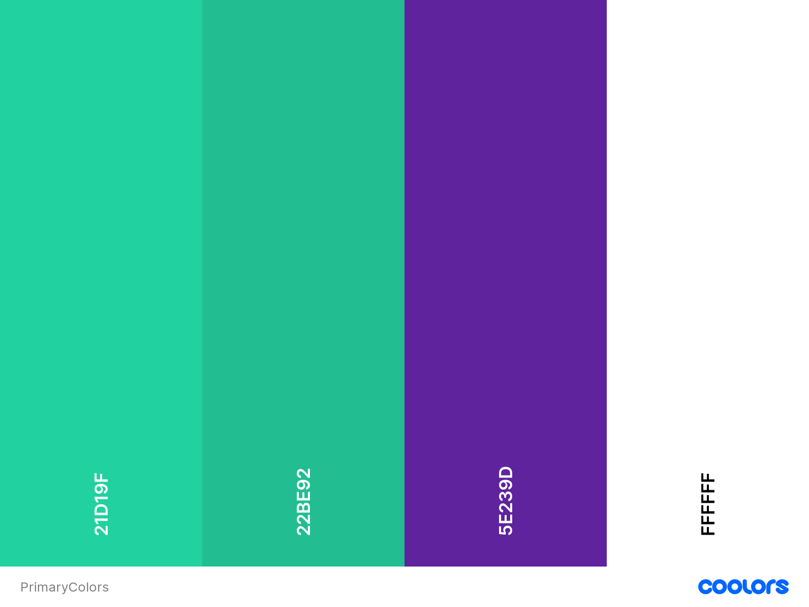
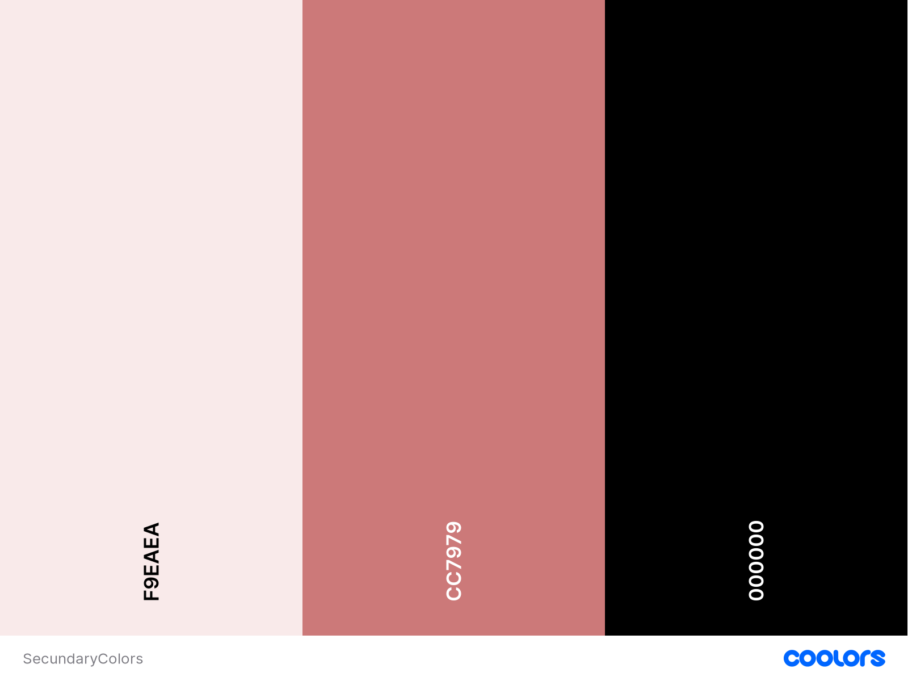
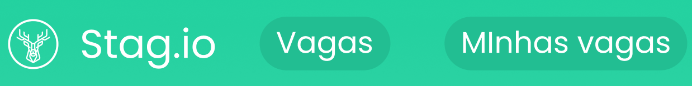
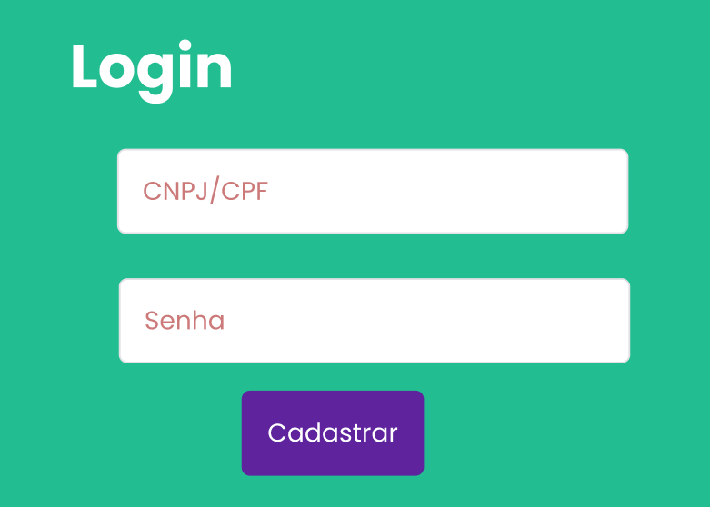

# Introdução

O guia de estilo representa as principais decisões e ideias de design que foram tomadas, com um conjunto de regras que busca auxiliar uma equipe a se manter alinhada quanto a aparência de todo um projeto, com o intuito de serem implementadas no produto final. Para o guia de estilo é definido a tipografia, as cores, os ícones e símbolos, espaçamentos, elementos de interface e também os elementos de ação. 

Entre os principais objetivos do guia de estilo estão: 

 - Servir como uma ferramenta de comunicação entre os membros da equipe de design e também com a equipe de desenvolvimento. 
 - Servir como uma base de consulta para que importantes decisões de design possam ser facilmente reutilizadas nas discussões sobre extensões ou versões futuras do produto.
 - Visualização com clareza para os membros da equipe de como ficará os designs do produto final.
 - Permitir uma consistência no desenvolvimento da interface e nos padrões das aplicações de design.

A organização do nosso guia de estilo será feito com base no livro Interação Humano Computador da autora Simone Barbosa e será orientado a partir do ciclo de vida Mayhew, o qual sugere que o guia de estilo tem que ser seguido ou modificado a cada nível de prototipagem.

O guia de estilo tem como público alvo os membros da equipe do projeto, para que possam se basear e construir o sistema com base nos designs definidos. Sendo atualizado e mantido com cada alteração de design feita pelos membros em reuniões.

# Elementos de interface

## Disposição espacial e grid

As imagens a seguir representam a disposição espacial dos componentes das telas do nosso protótipo. Essas imagens podem ser usadas como ferramenta para confirmar ou repensar a estrutura de nossas telas.

Figura 1: Tela Inicial

Figura 2: Cadastro Candidato

Figura 3: Cadastro Empresa

Figura 4: Perfil Candidato

Figura 5: Minhas Vagas

Figura 6: Vagas

Figura 7: Vaga

## Tipografia

A fonte usada no protótipo foi a <a href="https://fonts.google.com/specimen/Poppins?preview.text_type=custom" target="_blank">Poppins</a>, projetado por Ninad Kale e Jonny Pinhorn.

Figura 8: Exemplo fonte Poppins

## Símbolos não tipográficos

Abaixo tem-se os símbolos utilizados em nosso protótipo, dispô-los aqui permite a equipe manter uma mesma linha de símbolos caso seja necessário adicionar mais.

| Ícones |||||
|:--:|:--:|:--:|:--:|:--:|
|  |  |  |  |  |

<figcaption>Tabela 1 - Ícones</figcaption>

## Padrões de cores

Após discussões e reuniões dos integrantes do grupo foi realizado a escolha das cores principais do projeto Stag.io, baseando-se no protótipo realizado pela equipe.

### Cores Principais

Figura 9: Palhetas de cores principais

As cores principais foram feitas ergonômicamentes para a visualização do usuário, com cores que não sejam muito fortes para incomodar sua visão, fazendo com que seja agradável de se utilizar o sistema.

### Cores Secundárias

Figura 10: Palhetas de cores secundárias

As palhetas de cores secundárias foram escolhidas para informações complementares como POP-UPS e alguns botões destacados.

## Elementos de interação

### Estilos de interação

O usuário irá realizar as interações com o site através de elementos não tipográficos e de botões ou hiperlinks contendo elementos tipográficos.

Figura 11: Botões interativos

### Seleção de um estilo

O estilo foi escolhido de forma a maximizar a eficiência do usuário e a padronização das interações com o sistema, tão quanto para facilitar a visualização das principais ferramentas ao mesmo tempo mantento a simplicidade da aplicação.

## Elementos de ação

### Preenchimento de um campo

Todos os campos de preenchimento devem ser preenchidos manualmente pelo usuário seguindo suas necessidades.

Figura 11: Botões interativos

### Seleção e ativação

O usuário tem liberdade para fazer quaisquer seleções desejadas dentro do site, portanto nao há necessidade de bloqueio da seleção.

As ativações presentes no site estão fundadas principalmente nos fundamentos de usabilidade possibilitando uma maior liberdade para o usuário.

## Vocabulário e padrões

### Terminologia

Nosso site tem foco na conexão entre empresas e interessados em estágios, então a terminologia das palavras devem ser simples, de forma a possibilitar uma comunicação clara e direta entre estes dois envolvidos, com no máximo, terminologias mais específicas relacionadas ao tema de estágios.

### Tipos de tela

Como já mostrado no protótipo de alta fidelidade nesta documentação, as telas elaboradas para a aplicação são:

- Tela Inicial
- Cadastro de candidato
- Cadastro de empresa
- Perfil do candidato
- Vagas do candidato
- Vagas disponíveis
- Descrição de vaga

### Sequências de diálogos (feedback e confirmação de ações)

Na aplicação haverá <i>dialogs</i> para comunicar ao usuário suas ações, sendo confirmações de ações como algo salvo com sucesso, requisições de confirmação, como algo se algo deve realmente ser excluído, por exemplo, ou comunicações de erro.

# Bibliografia

> Barbosa, S. D. J.; Silva, B. S. da; Silveira, M. S.; Gasparini, I.; Darin, T.; Barbosa, G. D. J. (2021) Interação Humano-Computador e Experiência do usuário. Autopublicação.

# Versionamento

Versão | Data | Modificação | Autor(es) |
|--|--|--|--|
| 1.0 | 14/03/2022 | Adição Inicial dos Elementos de Interface | Álvaro Leles |
| 1.1 | 15/03/2022 | Introduçao do documento | Gabriel Avelino |
| 1.2 | 15/03/2022 | Adição da Tipografia e Bibliografia | Álvaro Leles |
| 1.3 | 16/03/2022 | Adição das cores e Elementos de ação e interação| Gabriel Avelino |
| 1.4 | 17/03/2022 | Adição da seção Vocabulário e Padrões | Álvaro Leles |