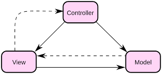
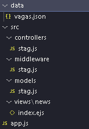
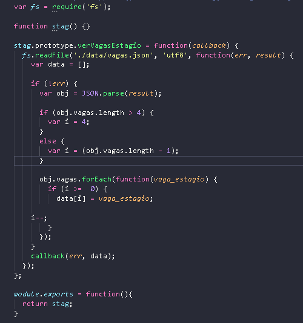
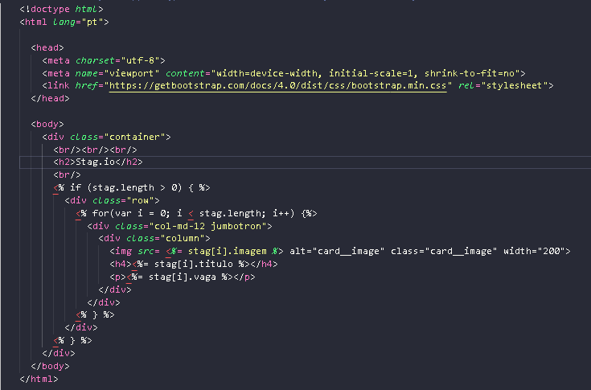
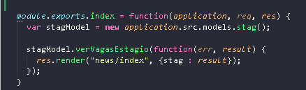
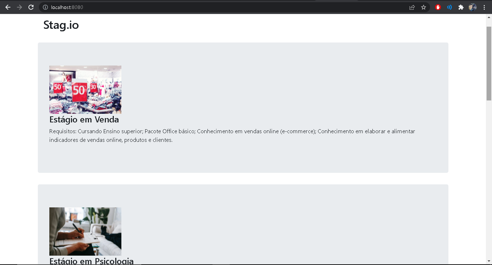
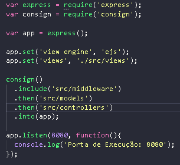
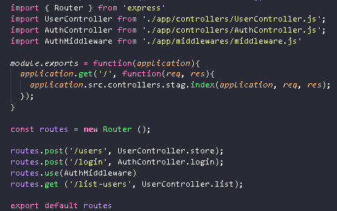

# Padrão MVC

## Introdução

Proposto por Trygve Reenskaug, o padrão MVC é uma sigla para Model (modelo), View (visão) e Controller (controle), que representam as etapas para sua execução, para facilitar as trocas de informações entre o sistema e o usuário. Devido a sua simplicidade este padrão é um dos mais utilizados por programadores, visto que consegue manter o nível de eficiência do projeto alto, mesmo apresentando arquitetura muito mais simples que os outros padrões. 

MVC |  | 
|--|--|
|[](../../assets/PadroesDeProjeto/first_MVC.png)|[](../../assets/PadroesDeProjeto/intro_MVC.png)|

<center>
<figcaption>
Figura 1: Diagrama MVC e divisão de arquivos
</figcaption>
</center>

## Metodologia

### Model

Essa camada é responsável pela leitura, escrita e validação de dados que são enviadas pelo controller. Também é onde ficam definidos o modo que a empresa trabalha e seus processos para execução do serviço. Desse modo, o grupo optou por implementar inicialmente o método **verVagasEstagio()**, para listar algumas vagas disponíveis em um arquivo Json, que futuramente será feita por uma consulta ao banco de dados. Onde inicialmente fazemos a leitura do arquivo Json e criamos a função **stag()** que será responsável por armazenar as vagas disponíveis, e posteriormente utilizamos o método **stag.verVagasEstagio** para salvar os dados do arquivo Json em uma lista, e por fim, retornar essa lista sempre que a função for chamada.

<center>

[](../../assets/PadroesDeProjeto/model.png)
<figcaption>
Figura 2: Exemplo de Model
</figcaption>
</center>

### View

Essa camada é responsável pela interação com o usuário, são onde entram em cenas os padrões "estéticos" da aplicação, onde os arquivos armazenados nessa camada são aqueles totalmente ligados a parte visual do projeto. Devido ao fato que essa parte da aplicação só será produzido mais a frente do semestre, decidimos criar um único arquivo de View utilizando Html simples, apenas para ilustrar os resultados produzidos pelas outras camadas, nesse caso, vamos resgatar a variável que armazenou os dados das vagas disponíveis para exibi-las em cards até o final lista.

[](../../assets/PadroesDeProjeto/views.png)
<center>
<figcaption>
Figura 3: Exemplo de View
</figcaption>
</center>

### Controller

Essa camada é responsável por lidar com as requisições do usuário, gerenciando a aplicação como um todo, o Controller funciona como um intermediário entre a Model e a View, requisitando as entradas e fornecendo as eventuais saídas entre as outras camadas. Criamos um controller simples até essa etapa do projeto, declarado como uma variável do tipo **stag** para que tenha acesso ao método **verVagasEstagio()**, e permitir a circulação desses dados entre os arquivos da Model e da View.

<center>
[](../../assets/PadroesDeProjeto/controller.png)
<figcaption>
Figura 4: Exemplo de Controller
</figcaption>
</center>

## Vantagens

* Segurança: O Controller impede que dados incorretos sejam processados e cheguem até o Model. 

* Organização: Devido a simplicidade organizacional, programar nesse padrão permite a fácil compreensão do código para qualquer novo integrante, o que possibilita maior facilidade em encontrar erros e corrigi-los.

* Eficiência: Também devido a sua simplicidade de arquitetura, a aplicação permanece mais "leve", ou seja, com componentes menos dependentes de outros, permitindo que vários desenvolvedores consigam trabalhar ao mesmo tempo de maneira independente.

* Tempo: Uma vez que vários integrantes conseguem trabalhar ao mesmo tempo na aplicação, ocorre então uma redução no tempo total do projeto.  

* Evoluções/Ajustes: Quando forem necessárias mudanças, o projeto estará mais suscetível a elas, já que os componentes não estão "enrijecidos" e dependentes. 

[](../../assets/PadroesDeProjeto/imagem_site01.png)
<center>
<figcaption>
Figura 5: Modelo MVC do protótipo de Stag.io
</figcaption>
</center>

# Padrão Middleware

## Introdução

O termo Middleware surgiu em uma conferência de Engenharia de Software da OTAN em 1968.
E abrange quase tudo desde aplicações web, como nosso caso, até sistemas de autenticação e ferramentas de mensageria, pois o Middleware é um tipo de software de computador que tem como objetivo fornecer serviços para softwares aplicativos fora aqueles já disponibilizados pelo sistema operacional.

## Metodologia

Para a implementação do middleware utilizamos o Express que foi desenvolvido com intuito de otimizar a elaboração de aplicações APIs e webs, e usa o Node para execução do javascript. Suas principais características são a criação rápida de aplicações utilizando um conjunto pequeno de arquivos e pastas, possibilita o tratamento de exceções dentro da aplicação e possui um sistema de rotas completo.


Nesse primeiro momento utilizamos o express para realizar o roteamento da aplicação em uma porta pré definida (8080) e em seguida é utilizado para organizar a ordem em que as views serão chamadas. Porém, o grupo planeja explorar muito mais desse padrão quando iniciarmos as opções de login da aplicação, para fazer verificações sobre autenticação e autorização no acesso a determinada rota.

<center>
[](../../assets/PadroesDeProjeto/middleware_1.png)
<figcaption>
Figura 6: Express para roteamento e organização das Views
</figcaption>
</center>

<center>
[](../../assets/PadroesDeProjeto/middleware_2.png)
<figcaption>
Figura 7: Ínicio da implementação de autenticação utilizando Express
</figcaption>
</center>

## Vantagens

* Comunicação entre diferentes tipos de aplicações: O Middleware foi desenvolvido para suportar as arquiteturas por meio de métodos orientados a processos, permitindo que dados possam ser movidos de uma aplicação para outra.

* Acesso a tecnologias distintas: A integração que é feita pelo Middleware permite prover acesso a diferentes tecnologias e localizadas em diferentes ambientes físicos.

* Processamento de informações: Com o Middleware intermediando informações de fontes distintas, elas passam a ser filtradas e refinadas, reduzindo consideravelmente o volume de dados processados e apresentando apenas as informações de alto-nível.

### Observações
Instruções para rodar a aplicação:<br/>
``` Navegue ate docs\assets\PadroesDeProjeto\AppPrototype```<br/>
``` npm install --save```<br/>
``` node app.js```

# Bibliografia
> - Grupo Curumim. Padrões Emergentes: API. Matéria de Arquitetura e Desenho de Software, 2021. Disponível em: <https://unbarqdsw2021-1.github.io/2021.1_G6_Curumim/padroes-de-projeto/padroes_emergentes/>. Acesso em: 14/03/2022.
> - Zucher, Vitor. O que é padrão MVC? Entenda arquitetura de softwares!.Publicado em 17/07/2020. Disponível em: https://www.lewagon.com/pt-BR/blog/o-que-e-padrao-mvc. Acessado em 15/03/2022.
> - Milene Serrano. Wiki Projeto de Padrões Emergentes. Publicado em 02 de Março de 2022. Acessado em 15/03/2022
> - Gabriel Fróes, Vanessa Weber. Middleware // Dicionário do Programador.Publicado em 12/07/2021. Disponível em:https://www.youtube.com/watch?v=HHd6F7rCzvY&ab_channel=C%C3%B3digoFonteTV. Acessado em 17/03/2022.

# Versionamento

Versão | Data | Modificação | Autor(es) |
|--|--|--|--|
|1.0|15/03/2022|Abertura do documento|João Victor e Ítalo Serra|
|1.1|16/03/2022|Processos do padrão MVC|João Victor e Ítalo Serra|
|1.2|16/03/2022|Imagens do código|João Victor e Ítalo Serra|
|1.3|17/03/2022|Metodologia do Middleware|João Victor e Ítalo Serra|