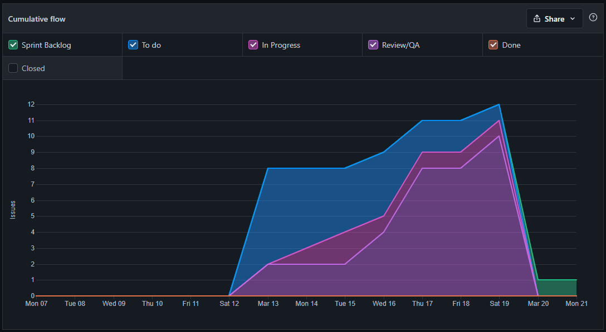
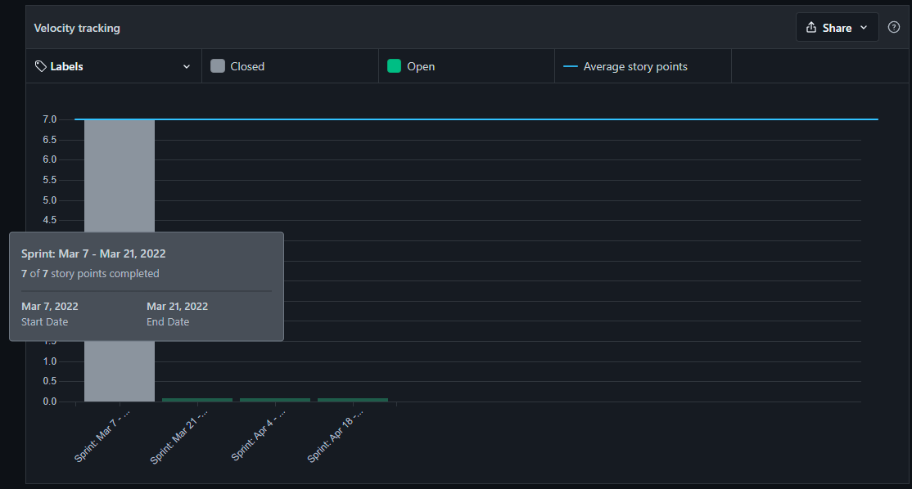
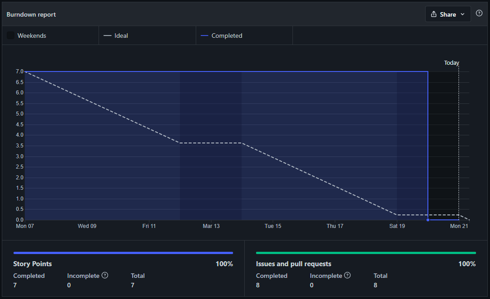

# Introdução

Nesta página estão focados os relatórios gerados a partir das issues associadas a sprint da entrega atual.

# Metodologia

## Cumulative flow

O gráfico abaixo representa nosso backlog da sprint, vendo os progresso entre as issues.

 
<figcaption>Figura 1 : Gráfico Cumulative flow</figcaption>

## Velocity Tracking

Abaixo temos o gráfico que verifica como as sprints foram concluídas e seu prazo, os quais foram entregues a tempo.

 
<figcaption>Figura 2 : Gráfico Velocity Tracking</figcaption>

## Burndown report

No Burndown report podemos verificar que a distribuição de issues closed foram encerradas muito em cima do prazo, este fato se dá pela demora para revisar a PULL REQUEST, a qual está associada com uma issue que te representa.

 
<figcaption>Figura 3 : Gráfico Burndown report</figcaption>

# Bibliografia

> ZENHUB. ZenHub. Disponível em: <https://zenhub.com>. Acesso em: 21 mar. 2022. 

> Zenhub. Track Team Velocity Sprint-Over-Sprint. Disponível <a href="https://help.zenhub.com/support/solutions/articles/43000010358-track-team-velocity-sprint-over-sprint" target="_blank">aqui</a>. Acessado em: 21 de mar de 2022

> Zenhub. Track Sprint Progress With Burndown Charts. Disponível <a href="https://help.zenhub.com/support/solutions/articles/43000010356-track-sprint-progress-with-burndown-charts" target="_blank">aqui</a>. Acessado em: 21 de mar de 2022

> Zenhub. Plan Long-Term Projects with Release Reports. Disponível <a href="https://help.zenhub.com/support/solutions/articles/43000010359-plan-long-term-projects-with-release-reports" target="_blank">aqui</a>. Acessado em: 21 de mar de 2022

# Versionamento

Versão | Data | Modificação | Autor(es) |
|--|--|--|--|
|1.0|21/03/2022|Criação do documento|Ítalo V., Ian, Guilherme de Morais, Italo S., João, Hérya, Guilherme Vial, Álvaro, Nathan, Gabriel|
|2.0|21/03/2022|Documento revisado|Ian, Guilherme de Morais|
