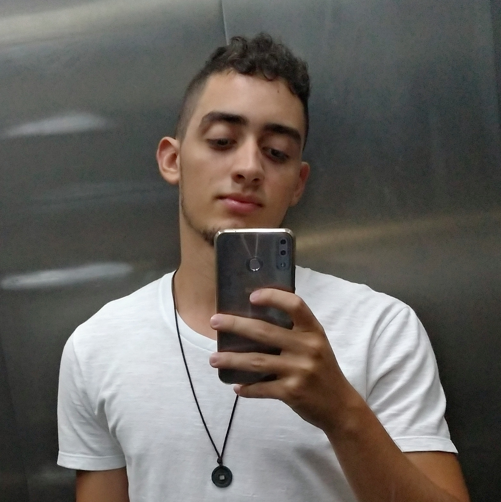
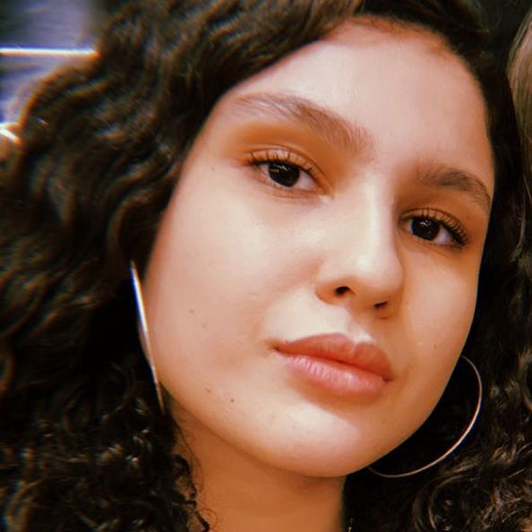
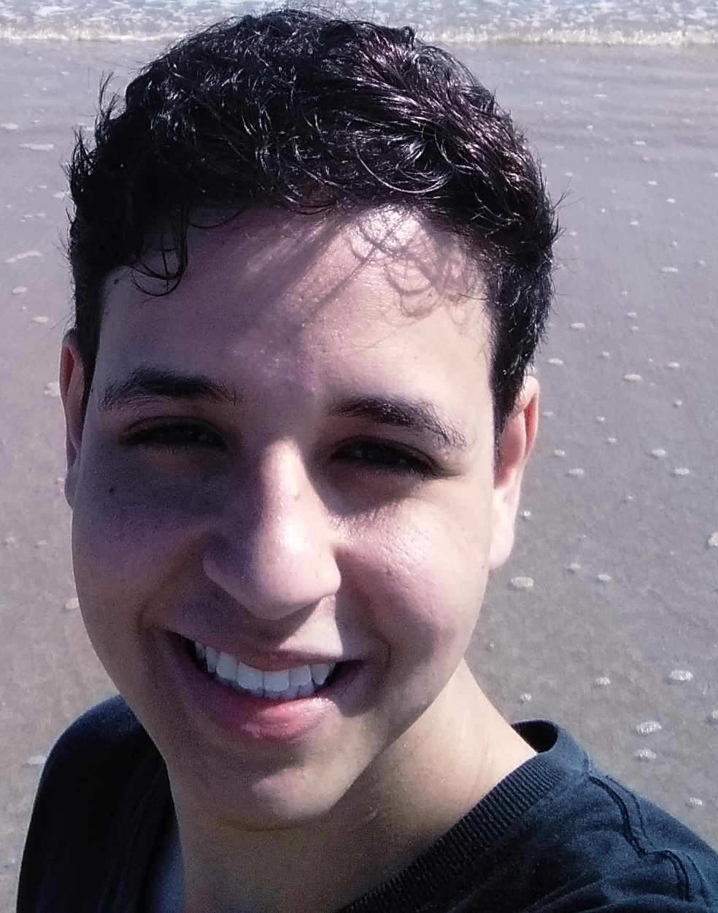
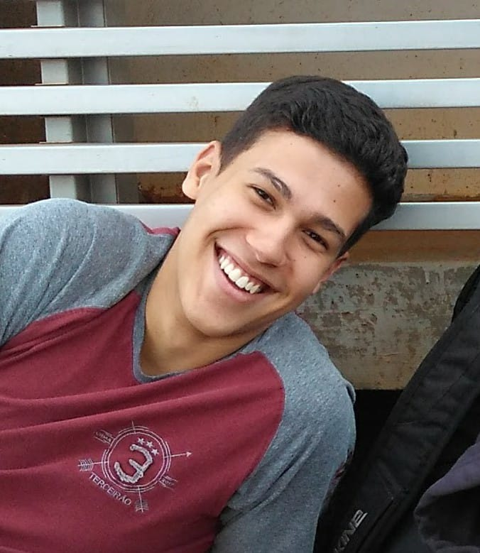
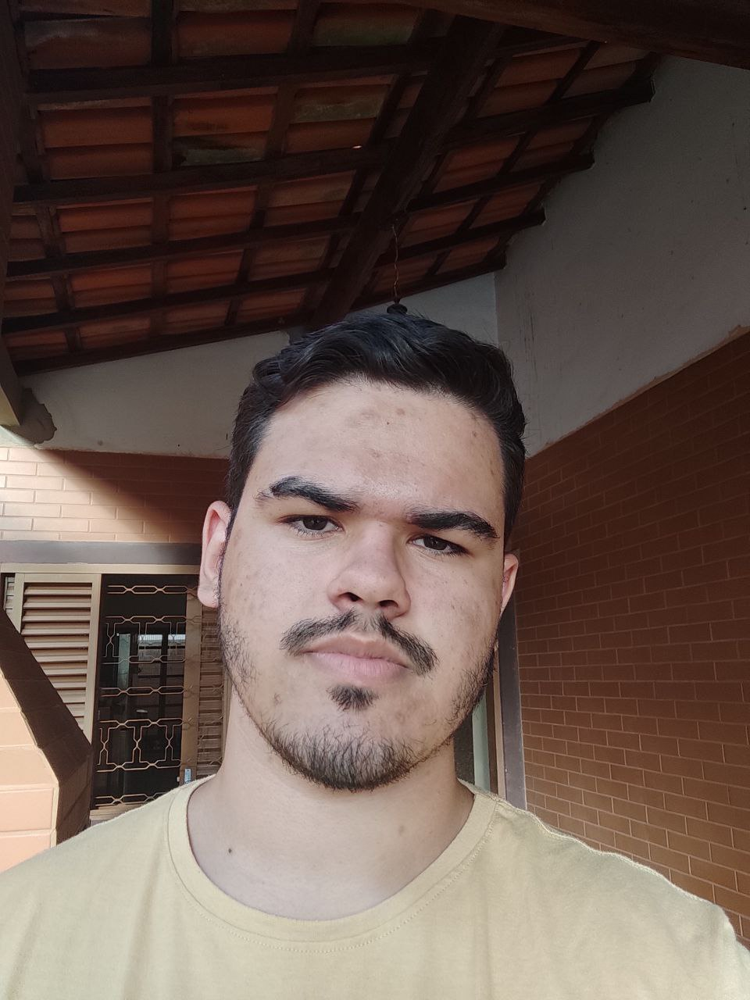

# Sobre

  

 

Repositório do grupo 03 - Stag.io, destinado ao desenvolvimento da documentação do projeto da disciplina Arquitetura e Desenho de Software, ministrada pela professora Milene serrano, na Universidade de Brasília - Gama, durante o período 2021/2.

O Stag.io tem como objetivo facilitar a relação empresa-estudante por meio da disponibilização de vagas de estágio através da empresa e iniciativa de interesse por meio do estagiário.

# Contribuidores

| Foto | Matrícula | Nome | GitHub | E-mail |
|:--:|:--:|:--:|:--:|:--:|
||18/0096991|Álvaro Guimarães|AlvaroLeles|180096991@aluno.unb.br|
||18/0100831|Gabriel Avelino|gabrielavelino|180100831@aluno.unb.br|
||18/0101617|Guilherme de Morais Richter|guilhermemoraisr|180101617@aluno.unb.br|
||19/0014032|Guilherme Rogelin Vial|GRVial|190014032@aluno.unb.br|
||18/0018574|Hérya Rodrigues|hryds|180018574@aluno.unb.br|
||18/0102087|Ian Fillipe|IanFPFerreira|180102087@aluno.unb.br|
||18/0102613|Italo Fernandes|italofernandes13|180102613@aluno.unb.br|
||18/0102656|Ítalo Vinícius|italovinicius18|180102656@aluno.unb.br|
||18/0103431|Joao Victor Valadao|joaovaladao|180103431@aluno.unb.br|
||17/0112004|Nathan Fernandes|Nathanserra|170112004@aluno.unb.br|

# Organização e encontros

A partir de um heatmap para verificar a disponibilidade de cada integrante e assim marcar reuniões para os melhores horários.

[Figura 1: Heatmap do grupo 3](.\assets\heatmap.png)

# Versionamento

Versão | Data | Modificação | Autor(es) | |
|--|--|--|--|
|1.0|24/01|Criação inicial da página Sobre|Ítalo Vinícius|